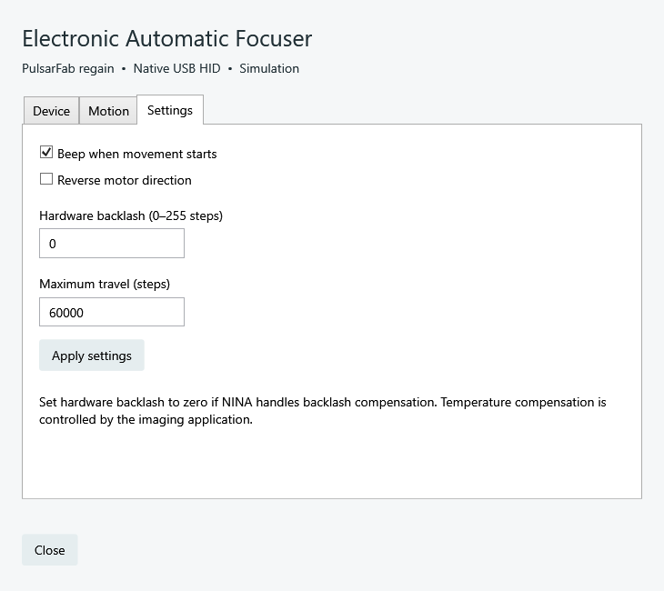
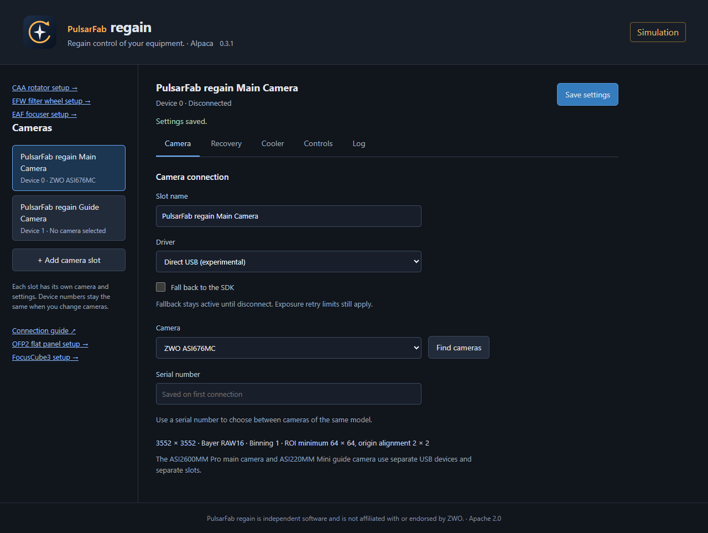
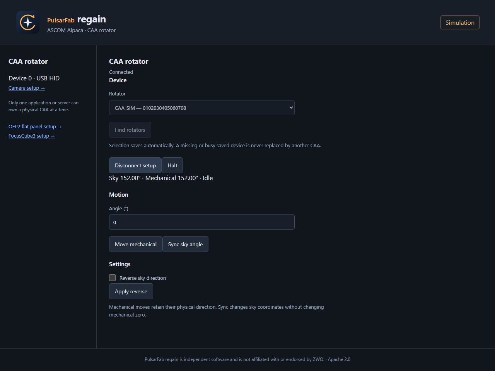
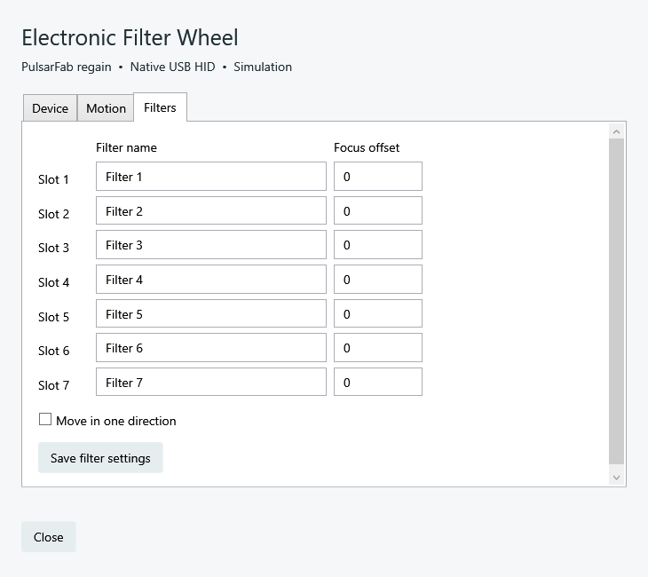
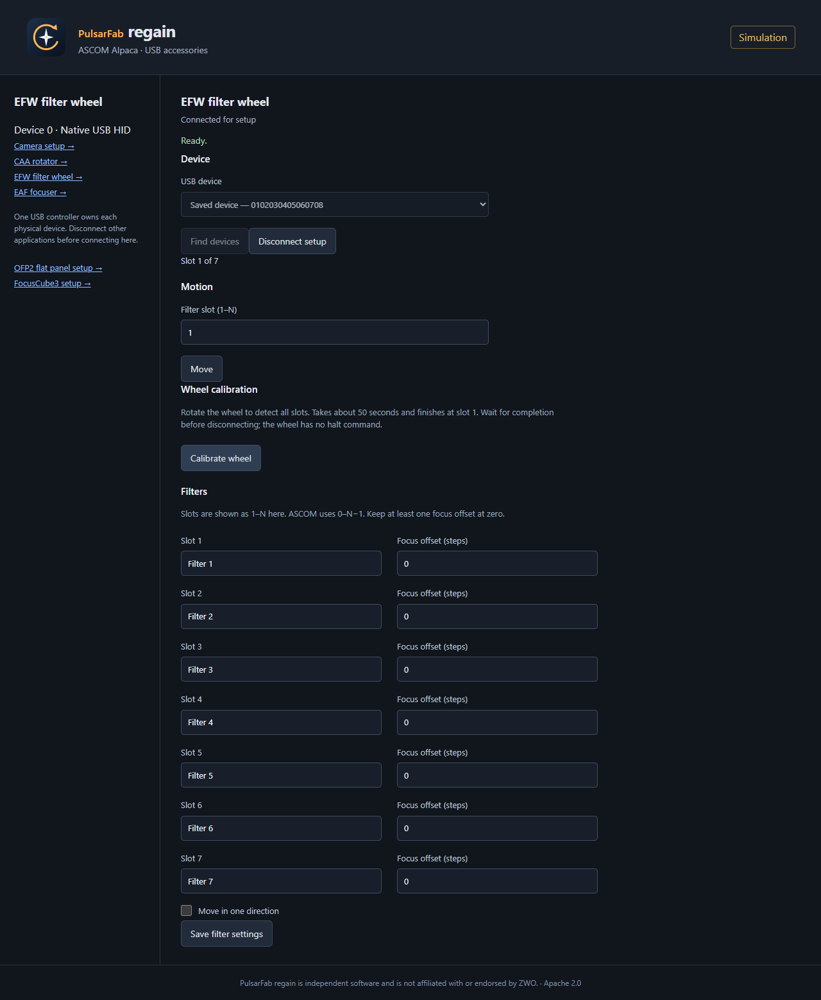
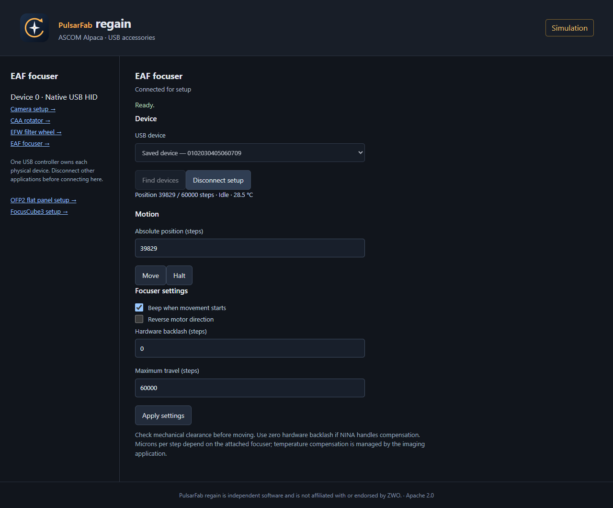

# PulsarFab regain


[](https://github.com/pulsarfab/regain/actions/workflows/build.yml)
[](LICENSE)

**Regain control of your equipment.**

PulsarFab regain connects your astronomy equipment to NINA, native Windows ASCOM,
and Alpaca. Control cameras, rotators, filter wheels, focusers, and flat panels
through a shared set of Rust drivers and matching setup tools.
Camera recovery retries failed downloads and short exposures while your imaging
application waits for the result.

Formerly **ZWOgain**. This rebrand is in current source; published 0.3.1.0
downloads still use the previous name. Build the packages below to try regain.
See [upgrading and brand assets](docs/branding.md) for preserved identities,
profile migration, and the new command names.

The ZWO SDK runs in a separate Rust process, so a camera crash or hang does not
take down NINA. An optional direct driver can capture without the SDK.

Choose the frontend for your application:

| Frontend | Runs on | Setup | Devices |
| --- | --- | --- | --- |
| Native NINA plugin | Windows x64 | NINA equipment setup gear | Cameras, CAA, EFW, EAF and FocusCube3 |
| Native Windows ASCOM | Windows x64; 32-bit and 64-bit clients | ASCOM Chooser or Start menu | Four camera entries, CAA, EFW, EAF and FocusCube3 |
| Standalone Alpaca server | Windows, Linux, macOS | Browser setup page | Camera slots plus CAA, EFW, EAF, FocusCube3 and OFP2 |

The native Windows ASCOM drivers use local Rust workers and matching
camera and accessory setup dialogs. They do not need an Alpaca server. Alpaca provides
network access and shares the same camera recovery and native accessory code.
FocusCube3 ASCOM clients share one local COM server and one exclusive serial connection.

[Screenshots](#screenshots) · [Install in NINA](#install-in-nina) · [Windows ASCOM setup](#windows-ascom-setup) ·
[Alpaca setup](#alpaca-setup) · [CAA controls](#caa-rotator) ·
[EFW and EAF](#efw-filter-wheel-and-eaf-focuser) · [OFP2 flat panel](#ofp2-flat-panel) · [FocusCube3](#pegasus-astro-focuscube3) · [Settings and logs](#settings-and-logs)

**PulsarFab regain is independent and is not affiliated with or supported by ZWO.**
The code and logo use the Apache-2.0 license. Bundled software has its own
licenses; see [third-party notices](THIRD_PARTY_NOTICES.md).

## Screenshots

Native ASCOM/NINA setup dialogs and the Alpaca browser interface. These views
use simulated devices in this table; the OFP2 and FocusCube3 sections below show physical hardware. Click an image to see it at full size. Native images
are renders of the actual WPF controls in the standalone ASCOM theme. NINA
uses the host application's theme.

| Native EFW calibration | Native EAF settings |
| --- | --- |
| [](docs/images/native-efw-calibration.png) | [](docs/images/native-eaf.png) |
| **Alpaca camera setup** | **Alpaca CAA rotator setup** |
| [](docs/images/alpaca-camera.png) | [](docs/images/alpaca-rotator.png) |

More screenshots accompany [EFW/EAF setup](#efw-filter-wheel-and-eaf-focuser)
and [camera recovery settings](#how-retries-work) below.

## Install in NINA

Requires **Windows x64** and **NINA 3.2.0.9001 or later**. Cameras also need the
**ZWO Windows camera driver**. CAA, EFW, and EAF use Windows' built-in HID driver.

1. Add `https://nina-plugins.psf-guard.com/` as a plugin source in NINA and install
   **PulsarFab regain**. Restart NINA.
2. Select **PulsarFab regain Retryable Camera** in the camera chooser.
3. Open the setup gear, refresh the list, pick your camera, and save.
4. Disconnect other apps using that camera, then connect in NINA.

For manual installation, close NINA and extract the plugin ZIP from
[Releases](https://github.com/pulsarfab/regain/releases/latest) into
`%LOCALAPPDATA%\NINA\Plugins\3.0.0\Regain`.

For a manual upgrade from ZWOgain, remove its old plugin folder while NINA is
closed before extracting the new package. Do not load both plugin DLLs.
Saved equipment profiles are outside the plugin folder and migrate automatically.

The camera choice and serial are saved. If you have two cameras of the same
model, enter the serial or connect the intended camera on its own once. Clear
the saved serial when replacing a camera. Save and reconnect after setup changes.

The ASI2600MM Pro main camera and ASI220MM Mini guide camera are separate USB
devices. Both ASI6200 editions appear as **ASI6200MM Pro** in the picker.

## Windows ASCOM setup

Use this for cameras, CAA, EFW, EAF or FocusCube3 connected directly to a Windows computer. Requires
**Windows 10 or later, x64**, **.NET Framework 4.8**, and the **ASCOM Platform**.
Cameras also require the separately installed **ZWO Windows camera driver**,
including in Direct USB mode. CAA, EFW, and EAF use Windows' HID driver and need no ZWO accessory SDK.

1. Download `Regain-ASCOM-<version>-win-x64-setup.exe` from
   [Releases](https://github.com/pulsarfab/regain/releases/latest), or build the
   installer from the current source using the commands below.
2. Close device-control applications and any running PulsarFab regain Alpaca server.
   Run the installer as administrator. It registers the drivers for both
   32-bit and 64-bit clients.
3. In your application's ASCOM Chooser, select **PulsarFab regain Retryable Camera 1**
   through **4**, or **PulsarFab regain CAA Rotator**, **PulsarFab regain EFW Filter Wheel**, or **PulsarFab regain EAF Focuser**, and open **Setup**.
4. Choose the physical device on **Device**. The selection saves automatically.
   Close setup, then connect in your application.

The Start menu also contains **PulsarFab regain ASCOM → Camera setup** (Camera 1) and
**CAA rotator setup**, **EFW filter wheel setup**, and **EAF focuser setup**. Configure Camera 2–4 through their own Chooser entries.
The dialogs use the host application's theme in NINA and a light theme in
standalone ASCOM clients.

### Camera setup

| Tab | What it configures |
| --- | --- |
| Device | Camera, serial number, SDK or Direct USB, optional SDK fallback |
| Recovery | Download retries, replacement exposure count and duration limit, reconnect delay |
| Cooler | Cooling recovery limits and optional cooler defaults on connection |
| Timeouts | Command, download and exposure grace periods |
| Controls | Optional gain, offset, USB limit, dew heater, fan and LED defaults |

The **SDK is the default**. Direct USB is experimental and available only for
supported models. Leave optional control defaults blank to retain the camera's
settings. Disconnect before changing setup. A connection opened with setup's
**Connect** button closes with the dialog; an application-owned connection is
managed in the application's equipment pane.

With no saved selection, Connect can choose the only available device of its type.
With multiple devices, select one first. The serial is saved; use distinct
serials for cameras of the same model. A saved device that is missing or busy
is not silently replaced with another device.

The camera interface supports RAW16 images, symmetric binning, ROI, gain,
offset, cooling and abort. ROI width must be a multiple of 8 and height a
multiple of 2 in binned pixels; Direct USB has additional model-specific
minimum sizes and alignment rules. StopExposure, asymmetric binning, pulse
guiding and fast readout are not implemented. Alpaca supports both ImageBytes
and JSON ImageArray downloads.

**Upgrading from the camera Alpaca bridge:** the native camera driver described
here is included in release 0.3.1.0. If an older package shows an Alpaca address
and port in camera setup, update to a build containing the native driver.
Select each local camera once in the new dialog. The old `server.json` is no
longer used; existing Alpaca profiles remain available for network use.
For a remote device, use the ASCOM Platform's Alpaca discovery/Chooser support.

### CAA setup

The CAA dialog has **Device**, **Motion**, **Settings**, **Reference** and
**Multi-turn** tabs. Choose the serial on Device; Motion provides ordinary
moves and sky-angle sync. Settings controls beep, reverse and alias. Reference
contains mechanical zero, reference assignment and the travel limit. See
[CAA controls and travel limits](#caa-rotator) before using reference or multi-turn
operations. Only one frontend may own a physical CAA at a time.

### Updates, uninstall and portable registration

Run a newer installer to upgrade in place. Setup refuses to replace files that
are in use and does not stop an active exposure. Uninstall through Windows
**Installed apps**. Upgrades and uninstall preserve settings and logs under
`%LOCALAPPDATA%\Regain`. No service or firewall rule is installed automatically.

For a portable install, extract the **complete** ASCOM ZIP to a permanent folder
and run this in an administrator PowerShell from that folder:

```powershell
$p = Start-Process .\Regain.ASCOM.Register.exe -ArgumentList /regserver -Wait -PassThru
if ($p.ExitCode) { throw 'Registration failed; check the ASCOM registration log' }
```

Use `/unregserver` instead of `/regserver` before deleting a portable install.
Keep the assemblies, workers and SDK library together. See
[ASCOM details and validation](docs/ascom.md) for diagnostics and test results.
The new native-camera transport and CAA Alpaca frontend have passed simulation
tests; hardware validation of these changes and a full ASCOM ConformU run remain
outstanding.

## Alpaca setup

The standalone server exposes cameras, CAA rotators, EFW filter wheels, EAF focusers, and Deep Sky Dad OFP2 flat panels to Alpaca clients.
It runs without .NET and does not require Windows COM registration.
CAA, EFW, and EAF network support is included in release 0.3.1.0.
OFP2 support is in current source and requires a newer build.

On Windows, extract `Regain-ASCOM-<version>-win-x64.zip` and run from that folder:

```powershell
.\regain-alpaca.exe --port 11111
```

On Linux or macOS, extract the matching `regain-rust-*` build artifact and run:

```sh
./regain-alpaca --port 11111
```

Keep the server, camera workers, `regain-caa`, `regain-accessories`,
`regain-ofp2` and SDK library together. The
computer hosting the server needs the appropriate USB drivers or permissions;
remote clients do not. See [Linux/macOS runtime requirements](docs/portable-rust.md).

### Select cameras

1. Open [http://127.0.0.1:11111/setup](http://127.0.0.1:11111/setup) on the server computer.
2. Select a camera slot. Choose **ZWO SDK** or **Direct USB (experimental)**,
   click **Find cameras**, and choose the camera.
3. Set its serial if needed, configure recovery/cooling defaults, and click
   **Save settings**. Add slots for additional cameras. Main and guide cameras
   are separate USB devices.
4. Discover the server in your Alpaca client, or enter its address and HTTP port.
   Windows ASCOM clients can use the Platform's Alpaca discovery/Chooser support.

Only configured devices appear in discovery. Camera device numbers and UUIDs
remain stable when changing a slot's physical camera. Disconnect all clients
before editing that device's setup or scanning USB.


*Actual browser screenshot using simulation. This example selects Direct USB;
SDK mode is the default. Screenshots describe the current source build.*

### Select the CAA rotator

1. Follow **CAA rotator setup →** from the camera setup page, or open
   [the rotator setup page](http://127.0.0.1:11111/setup/v1/rotator/0/setup).
2. Click **Find rotators** and choose the CAA serial. Selection saves automatically.
3. Select **PulsarFab regain CAA Rotator**, device **0**, in your Alpaca client. The server
   exposes the standard `IRotatorV3` operations at `/api/v1/rotator/0`.

The browser's **Connect for setup** button provides a temporary test connection,
with mechanical movement, sky-angle sync, reverse and **Halt**. Use **Disconnect
setup** when finished. Additional origin, reference, limit, beep, alias and
explicit multi-turn operations are available through the
[`Regain.CAA.*` actions](docs/caa-frontends.md#ascom-actions).
Disconnect NINA/native ASCOM before connecting the same CAA through Alpaca.


*Actual browser screenshot connected to the simulated CAA; no physical rotator moved.*

### Connect across a LAN

The default listener accepts local connections only. To use a trusted LAN,
substitute the server computer's IPv4 address:

```sh
./regain-alpaca --listen 192.168.1.10 --port 11111
```

On Windows, use `.\regain-alpaca.exe` with the same arguments. Open
`http://192.168.1.10:11111/setup` from another computer. Allow the chosen HTTP TCP
port and **UDP 32227** through the host firewall if needed. Discovery reports
the HTTP port; clients can also connect by address if discovery is unavailable.
The server has no authentication: keep it on a trusted network and do not expose
it to the public internet.

| Option | Purpose |
| --- | --- |
| `--listen ADDRESS` | Bind to an IPv4 address; default `127.0.0.1` |
| `--port PORT` | HTTP port; default `11111` |
| `--no-discovery` | Disable UDP discovery |
| `--profiles PATH` | Choose the saved camera settings file |
| `--workers DIRECTORY` | Locate camera workers, the CAA worker and default SDK library |
| `--sdk PATH` | Override the camera SDK DLL, SO or dylib |
| `--simulate` | Try cameras and CAA without accessing USB |

Keep the server running while clients are connected. For unattended startup,
configure your own systemd, launchd or Windows startup task; none is installed
by PulsarFab regain. Use an absolute `--profiles` path and give that account USB access.

## EFW filter wheel and EAF focuser

The plugin adds **PulsarFab regain EFW Filter Wheel** and **PulsarFab regain EAF Focuser** to
NINA's equipment lists. The Windows ASCOM installer includes matching native
Chooser entries and CAA-styled setup dialogs. All three frontends use the
SDK-free Rust USB worker directly; native ASCOM needs no Alpaca server.
EFW and EAF support is included in release 0.3.1.0.

1. Open the device's setup gear or ASCOM **Setup**, refresh USB devices, and
   select its serial. Close other controllers using that device.
2. Connect for setup. EFW **Filters** configures slot names, focus offsets, and
   unidirectional moves; **Motion** uses display slots 1–N.
3. EAF **Motion** provides absolute step moves and Halt. **Settings** controls
   beep, reverse, hardware backlash, and maximum travel. Check mechanical
   clearance before moving and use zero hardware backlash if NINA handles it.
4. Close setup and connect through your imaging application. NINA keeps its
   existing per-filter exposure/autofocus settings. Temperature compensation
   remains the imaging application's responsibility.

Native setup views below are renders of the real WPF controls with simulated
devices, using the same standalone theme as the CAA driver.




For Alpaca, open **EFW filter wheel setup** or **EAF focuser setup** from the
server page. Their endpoints are `/api/v1/filterwheel/0/` and
`/api/v1/focuser/0/`; each appears in discovery after serial selection.





Hardware validation covers a seven-position EFW-S-0 (firmware 3.6.2) and an
EAFN (3.8.1), including native Rust, Alpaca, and 32-bit/64-bit ASCOM movement
and restoration. Older EAF firmware, EAF Pro/Bluetooth, and dual-disc wheels
are not supported. Interactive NINA autofocus and ConformU remain untested.
Use **Motion → Calibrate wheel** in native ASCOM/NINA setup, or **Calibrate wheel**
on the Alpaca page. Calibration detects the slots, shows live progress, and
finishes at slot 1; names and focus offsets are preserved. The attached EFW
passed SDK and native calibration in about 49 seconds, followed by full slot sweeps.
The same operation is available through the [`Regain.Calibrate` action](docs/accessories.md#native-calibration-controls-and-api).


See the [USB tracing playbook, protocol, setup and validation details](docs/accessories.md).

## Pegasus Astro FocusCube3

Current source includes a new **pure Rust USB serial crate**, `regain-fc3`,
a native NINA focuser provider, a styled native ASCOM driver, and **Alpaca
Focuser device 1**. Release 0.3.1.0 predates this support.

On Windows use the built-in USB Serial Device driver. Close the device's
connection in Pegasus Unity; its background server may hold the COM port
when the window closes. Select **PulsarFab regain Pegasus FocusCube3** in NINA or the
ASCOM Focuser Chooser. The ASCOM Start menu shortcut opens the same setup UI.
For Alpaca, open `http://127.0.0.1:11111/setup/v1/focuser/1/setup`, find/select
the USB serial, and connect for setup. EAF remains Focuser device 0.

| Native ASCOM/NINA setup | Alpaca setup |
| --- | --- |
|  |  |

Both screenshots show the **physical FocusCube3, firmware 1.8.2**. Controls
include absolute movement, halt, temperature, direction, backlash, and speed.
The verified firmware rounds odd speeds down, so speed uses even values
2–400. The driver waits for deceleration after halt.

**Separate 32-bit and 64-bit ASCOM clients share one local server and serial
worker.** Disconnecting one client leaves the others connected. The native
NINA provider, Alpaca, and Unity still need exclusive ownership relative to
one another. A common background service for sharing between those frontends
is deferred; NINA can use the ASCOM driver when ASCOM sharing is needed.

See [FocusCube3 setup, protocol, trace evidence, hardware tests, and sharing
notes](docs/focuscube3.md) for the full playbook.

## OFP2 flat panel

Deep Sky Dad **OFP2** is supported by a pure Rust USB serial crate and the
Alpaca server as **CoverCalibrator 0**. No vendor ASCOM driver or SDK is needed.
This is current-source support; release 0.3.1.0 does not contain it.

1. Connect USB and external power. Disconnect the vendor ASCOM driver and
   close any application holding the panel's serial port.
2. Build `cargo build --workspace --release --locked`, then start
   `.\target\release\regain-alpaca.exe --port 11111` on Windows.
3. Open `http://127.0.0.1:11111/setup/v1/covercalibrator/0/setup`.
   **Find panels**, select the OFP2, and **Connect for setup**.
4. Use Open, Close, Halt, and brightness 0–4096. Disconnect setup when done,
   then select the panel through your application's Alpaca discovery support.

Windows uses its built-in USB serial driver. Linux needs serial-port access;
macOS uses its USB modem port. Selection follows the USB serial if the port
name changes. Existing heater settings and endpoint calibration are preserved.

[](docs/images/alpaca-ofp2.png)

This historical screenshot uses the **physical OFP2**, firmware 1.0.14.2,
and was captured before the PulsarFab regain rebrand. The Rust worker
and Alpaca server both passed real opening, closing, halt/resume and lighting
tests. The panel was restored to closed with its light off. Read the
[protocol, Rust API, setup, and test notes](docs/ofp2.md) and
[hardware evidence](docs/ofp2-evidence.json).

## Settings and logs

Selections and settings are independent between NINA, native ASCOM and Alpaca.
Keep these files when upgrading:

| Frontend | Settings location |
| --- | --- |
| Windows ASCOM cameras | `%LOCALAPPDATA%\Regain\ASCOM\camera-1.json` through `camera-4.json` |
| Windows ASCOM CAA | `%LOCALAPPDATA%\Regain\Rotators\ascom.json` |
| NINA CAA | `%LOCALAPPDATA%\Regain\Rotators\nina.json` |
| Native NINA/ASCOM EFW and EAF | `%LOCALAPPDATA%\Regain\Accessories\{efw,eaf}-{nina,ascom}.json` |
| Alpaca on Windows | `%LOCALAPPDATA%\Regain\Alpaca\cameras.json` |
| Alpaca on Linux/macOS | `$XDG_CONFIG_HOME/Regain/Alpaca/cameras.json`, or `$HOME/.config/Regain/Alpaca/cameras.json` |
| Alpaca CAA | Beside the camera settings file, with extension `.rotator.json` (normally `cameras.rotator.json`) |
| Alpaca EFW and EAF | Beside the camera settings file: `cameras.efw.json` and `cameras.eaf.json` |

EFW/EAF native logs are `efw.log` and `eaf.log` in their Accessories directory.
Native camera logs are under `%LOCALAPPDATA%\Regain\ASCOM\logs`; CAA frontend
logs are in `%LOCALAPPDATA%\Regain\Rotators\rotator.log`. Alpaca camera logs
are in the `logs` directory beside its settings file and on the browser's **Log**
tab. Native registration errors are in `%LOCALAPPDATA%\Regain\ASCOM\registration.log`.
`REGAIN_ASCOM_PROFILES` overrides the native camera settings directory;
Alpaca's `--profiles` flag selects its settings file.

## How retries work

| Action | Default |
| --- | --- |
| Retry a download of the same frame | 2 retries, at any exposure length |
| Reconnect and take a new exposure | 3 retries, only for exposures of 30 seconds or less |
| Wait before reconnecting | 5 seconds |

These limits are configurable. A zero count disables that type of retry.

The camera recovery engine is shared by NINA, native ASCOM and Alpaca. In ASCOM,
use the **Recovery**, **Cooler** and **Timeouts** tabs; in Alpaca, use **Recovery**
and **Cooler**, then **Save settings**.


*Alpaca recovery settings in simulation, showing the shared default retry policy.*

The SDK can retry a download only while it still reports a ready frame. The
direct ASI2600, ASI6200, and ASI676 drivers can reread a frame held in camera
memory. They start the transfer again from byte zero. The guide camera cannot
reread the same frame.

Each direct download attempt uses the configured download timeout (60 seconds
by default). Logs include the failed chunk, completed bytes, and USB status.
On Windows, the direct ASI2600 P25 driver can also reopen its USB handle within
that retry budget. It checks the camera identity and previously downloaded pixels
before returning the recovered frame. [USB lifecycle tests](docs/usb-lifecycle.md)
cover this path; recovery across worker replacement is still experimental.
Windows diagnostic commands can reset or cycle the attached ASI2600 P25's USB
port. Tests required a new exposure afterward, so automatic retries do not use them.

On reconnect, PulsarFab regain restores the camera settings and cooler setpoint. Before
another exposure, it waits for cooling to return near the temperature measured
before the error. It also checks cooler output; holding the restored setpoint
for 30 seconds is accepted. It need not finish cooling to the setpoint first.

Abort stops the capture. PulsarFab regain then reconnects to restore controls and cooling
without taking another exposure. A stop/reset error after a successful download
keeps the image and reconnects before the next capture. If recovery fails, NINA
receives the error. Details go in NINA's log.

NINA's normal log includes retry reasons, backend fallback, cooler recovery,
and successful recovery. Recovered failures do not show error dialogs or fail
the capture. Routine frame messages use Debug level.

## Supported cameras

The **SDK is the default**. To try capture without it, enable **Direct USB driver
(experimental)** in setup. The direct driver still needs the installed ZWO
Windows driver.

| Tested camera interface | Binning | Maximum direct exposure |
| --- | --- | --- |
| ASI676MC USB3 | 1 | 30 seconds |
| ASI2600MM Pro (non-P25) main USB3 | 1–4 | 2,000 seconds |
| ASI2600MM Pro P25 USB3 | 1–4 | 2,000 seconds |
| ASI6200MM Pro (non-P25) USB3 | 1–4 | 2,000 seconds |
| ASI6200MM Pro P25 USB3 | 1–4 | 2,000 seconds |
| ASI220MM Mini guide USB2 | 1–2 | 10 seconds |

Other cameras can use SDK mode if supported by the bundled ZWO SDK. ASI2600
P25 and non-P25 ASI6200 support are included in release 0.3.0.0.
The ASI6200 editions share a USB ID; the driver reads the
hardware revision to select timing and controls.

Direct capture includes RAW16 images, factory defect correction, gain and
offset. The ASI2600 and ASI6200 also support cooling and the dew heater. The
P25 models have optional fan and LED settings. ASI2600 P25 and original ASI6200
cooler recovery passed in SDK, direct and SDK-fallback modes. Auxiliary controls
were checked against each camera's capabilities.
Selected image areas are adjusted to the camera's size and alignment rules.

**Fall back to SDK** is a separate option. It uses the same camera and stays
active until disconnect. It cannot repeat a failed long exposure unless your
recapture limit allows it.

Testing used dark frames. Full 1,200-second captures passed in NINA on the
ASI2600 and ASI6200, both original and P25. The 2,000-second limit has not been tested.
USB retry tests used controlled faults, not cable removal or power loss.
Live view and trigger modes are not supported. Temperature and cooler power
update during exposures. Control changes wait until capture ends; the direct
cooler controller keeps running.

See [NINA tests](docs/nina-end-to-end.md), [ASI2600 P25 results](docs/asi2600-p25.md),
[ASI6200 P25 results](docs/asi6200-p25.md),
[non-P25 ASI6200 results](docs/asi6200-original.md),
and [transfer recovery and SDK differences](docs/transfer-recovery.md).

## CAA rotator

Select **PulsarFab regain CAA Rotator** in NINA, the Windows ASCOM Chooser, or an Alpaca
client after [configuring the server](#select-the-caa-rotator). The choice saves
automatically. All three use the same SDK-free Rust USB HID worker.

Setup includes motion, stop, logical sync, reverse, beep, alias, travel limits,
and **Set current position to mechanical 0°**. An explicit multi-turn control
uses 90° segments with reference resets; 450° forward and return were tested.
Normal positioning keeps the firmware travel limit. Reference resets bypass
cumulative cable-wrap protection and are never automatic during normal moves.

A CAA-M54 with firmware 1.1.1 passed Windows hardware tests. Linux/macOS HID
backends compile but still need hardware testing. The NINA and ASCOM frontends
are included in release 0.3.0.0. See [setup and ASCOM actions](docs/caa-frontends.md)
and [CAA protocol and hardware results](docs/caa.md).

## Help add a camera

Download the **Camera Kit** ZIP from
[Releases](https://github.com/pulsarfab/regain/releases/latest), extract it, and
run `Regain-CameraKit.exe`. Close other camera apps and cap the camera first.
No Python or compiler is needed.

The kit tests camera settings and records the SDK's USB traffic in a local ZIP.
Image samples are optional. Nothing uploads automatically; review the files
before sharing. See the [kit instructions](scripts/camera-kit/README.md).

## Build from source

The Rust workers also build on Linux and macOS using native USB access. Camera
testing on those systems is still needed; see [build and test instructions](docs/portable-rust.md).
Native CI packages include SDK 1.41 and standalone camera commands for listing
cameras, inspecting controls, and saving RAW16 captures.
The NINA plugin requires Windows.

Windows source builds require .NET 8, the Rust MSVC toolchain, and Visual Studio
C++ build tools.
The ASI SDK DLL and header are included.

```powershell
./scripts/test.ps1
# Close NINA before installing:
./scripts/build.ps1 -Install
```

To build the Windows ASCOM package and installer:

```powershell
./scripts/build.ps1 -StageOnly
./scripts/build-ascom.ps1
./scripts/install-inno.ps1  # Once: install the pinned Inno Setup compiler
./scripts/build-ascom-installer.ps1
```

Packages, the setup EXE and their checksums are written to `artifacts`.
On Linux/macOS, `cargo build --release --locked` builds the standalone server
and workers; see [portable builds](docs/portable-rust.md).

Omit `-Install` from the NINA build command to build a ZIP only. Local builds are
unsigned. Release binaries are signed by StackFoundry LLC.

More details: [architecture](docs/architecture.md),
[camera bring-up](docs/camera-bringup.md), [inspection tools](scripts/inspection/README.md),
and [release process](docs/releasing.md).
