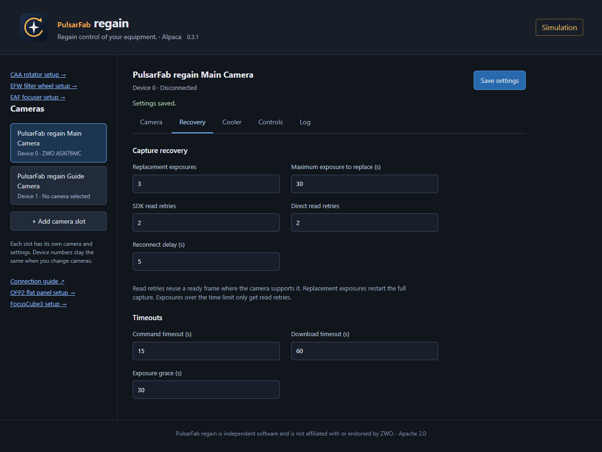
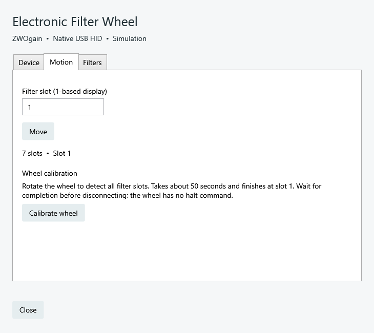
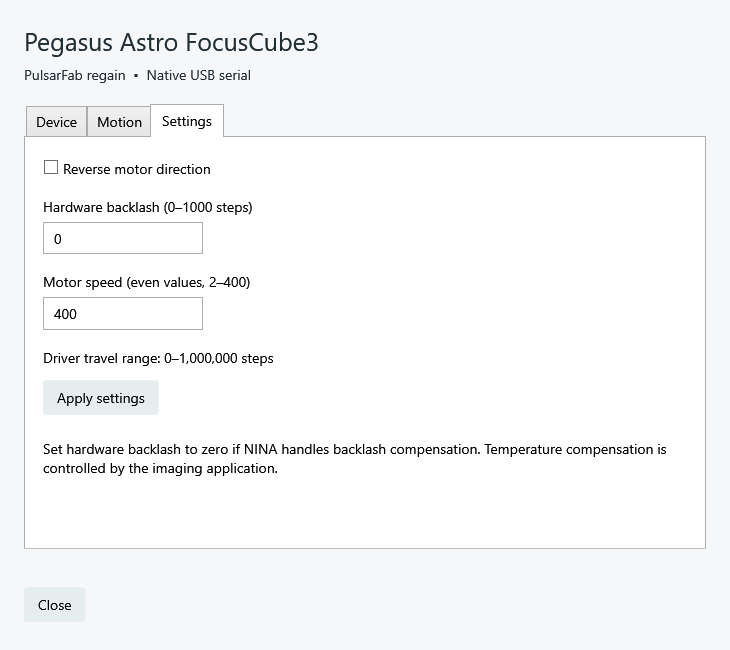
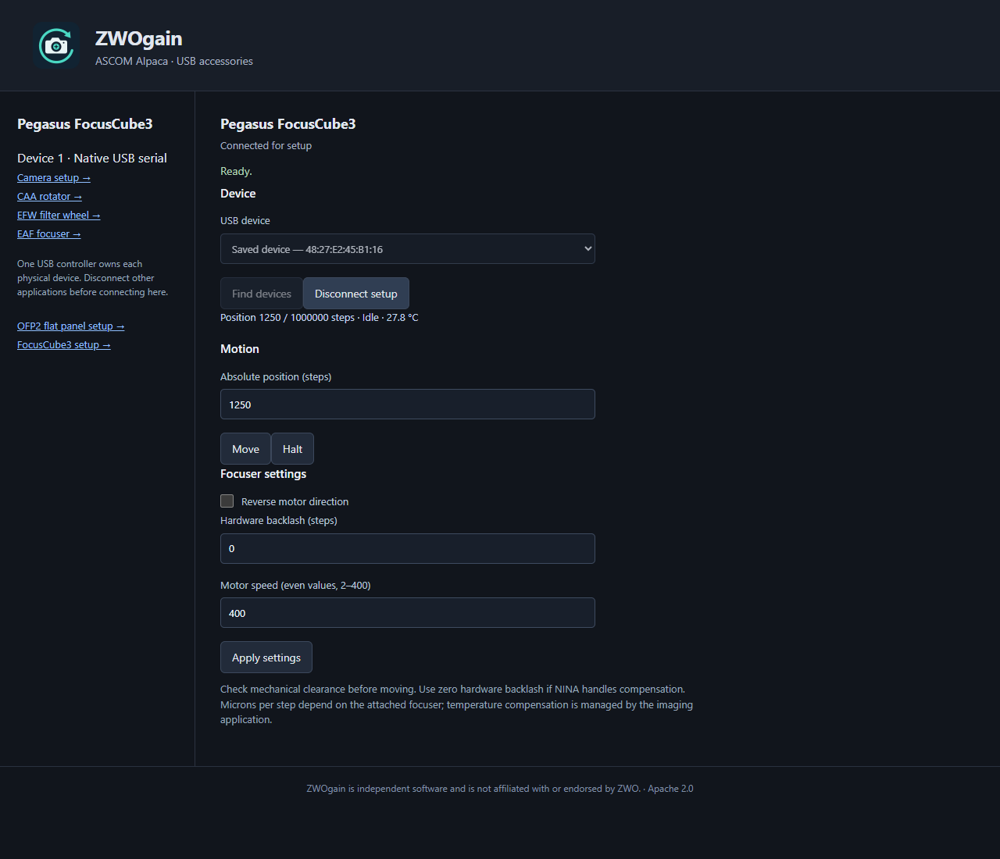

# PulsarFab regain


[](https://github.com/pulsarfab/regain/actions/workflows/build.yml)
[](LICENSE)

**Recover failed camera downloads. Control your equipment without vendor SDKs. Run your rig through one Alpaca server.**

PulsarFab regain brings Rust device drivers to **NINA**, **native Windows ASCOM**,
and **Alpaca**. Its direct camera drivers can reread an image after a failed USB
download, saving the exposure. SDK mode covers more ZWO cameras and isolates the
vendor SDK in a separate process.

[Documentation](https://pulsarfab.com/docs/regain/) ·
[Downloads](https://github.com/pulsarfab/regain/releases/latest) ·
[Install & upgrade](https://pulsarfab.com/docs/regain/install.html) ·
[Supported hardware](#supported-hardware)

## What do you want to do?

### Save an exposure after a failed download

Choose **Direct USB (experimental)** with an ASI2600MM Pro, ASI6200MM Pro, or
ASI676MC. Regain talks to the camera without the ZWO SDK and can reread the image
still in camera memory. A download retry does not repeat the exposure—even a
long one. The transport limits stalled reads and rejects incomplete images.

Use **PulsarFab regain Retryable Camera** in NINA, a native ASCOM camera entry,
or an Alpaca camera slot. All three use the same recovery engine.
[Choose a camera mode](https://pulsarfab.com/docs/regain/cameras.html#backend).

### Keep using your camera in SDK mode

The default **ZWO SDK** mode supports cameras covered by the bundled SDK. Regain
can retry a download while the SDK still reports an image ready, reconnect and
restore camera and cooler settings, or restart a stuck SDK worker. Taking a
replacement exposure is a separate, configurable option.

<a id="how-retries-work"></a>

By default, regain allows **two download retries** and **three replacement
exposures for captures up to 30 seconds**. Download retries on direct cameras
with reread support also apply to longer exposures. Recovery requires the image
to remain available; it cannot restore a frame lost when camera power is removed.
[Configure recovery](https://pulsarfab.com/docs/regain/cameras.html#recovery).

### Run the whole rig from a small headless computer

One **regain Alpaca server** exposes supported cameras, rotators, filter wheels,
focusers, and a flat panel over your LAN. Configure devices in a browser and
connect from Alpaca clients. The Rust server runs without .NET or a desktop UI
on Windows, Linux, and macOS, with ARM64 builds for small hosts.
[Set up a headless rig](https://pulsarfab.com/docs/regain/alpaca.html#headless).

### Connect more than two ASCOM cameras

Assign your main camera, guider, and second imaging train to separate
**Retryable Camera 1–4** entries. Each keeps its own camera serial, mode, and
recovery settings. Both 32-bit and 64-bit ASCOM clients are supported.
[Configure camera slots](https://pulsarfab.com/docs/regain/ascom.html#multiple-cameras).

### Use a lightweight local ASCOM driver

The native ASCOM adapter handles the connection to your application; Rust
workers handle device control and camera recovery. Matching setup dialogs cover
cameras and accessories. An Alpaca server is optional.
[Install native ASCOM](https://pulsarfab.com/docs/regain/ascom.html).

## Integration points

| Integration | Where it runs | Equipment |
| --- | --- | --- |
| **Native NINA plugin** | Windows x64, NINA ≥3.2.0.9001 | Cameras, CAA, EFW, EAF, FocusCube3 |
| **Native ASCOM drivers** | Windows x64; 32/64-bit clients | Four camera entries, CAA, EFW, EAF, FocusCube3 |
| **Universal Alpaca server** | Windows, Linux, macOS | Camera slots and all supported accessories, including OFP2 |
| **Rust crates and worker CLIs** | Windows, Linux, macOS | Embed USB, HID, and serial device control in another application |

OFP2 connects to NINA and ASCOM applications through Alpaca discovery.
FocusCube3 ASCOM clients share one local server; other frontends need exclusive
access to the device. See [connection options](https://pulsarfab.com/docs/regain/#choose).

## Supported hardware

<a id="supported-cameras"></a>

### Camera modes

**Direct USB** uses regain's Rust drivers without the ZWO SDK. **ZWO SDK** is the
default mode and supports a broader range of cameras. Both work in NINA, native
ASCOM, and Alpaca.

| Camera | SDK-free capture | Reread the same image after a failed download | SDK mode |
| --- | --- | --- | --- |
| **ZWO ASI2600MM Pro** | Yes, experimental | Yes, in Direct USB mode | Yes |
| **ZWO ASI6200MM Pro** | Yes, experimental | Yes, in Direct USB mode | Yes |
| **ZWO ASI676MC** | Yes, experimental | Yes, in Direct USB mode | Yes |
| **ZWO ASI220MM Mini** | Yes, experimental | No direct reread support | Yes |
| **Other ZWO ASI cameras** | No | Depends on the SDK keeping the image available | If supported by the bundled SDK |

SDK download retries depend on the SDK's ready-frame state; they do not use
regain's direct memory reread. Direct capture supports RAW16, with model-specific
exposure and binning limits. See the [camera support table](https://pulsarfab.com/docs/regain/hardware.html#cameras).

### Accessories: all SDK-free

<a id="caa-rotator"></a>
<a id="efw-filter-wheel-and-eaf-focuser"></a>
<a id="pegasus-astro-focuscube3"></a>
<a id="ofp2-flat-panel"></a>

| Hardware | Connection | Controls |
| --- | --- | --- |
| **ZWO CAA** | USB HID | Rotation, sync, reverse, limits |
| **ZWO EFW** | USB HID | Filter selection, names, offsets, direction, calibration |
| **ZWO EAF** | USB HID | Focus, halt, reverse, backlash, travel limit, temperature |
| **Pegasus Astro FocusCube3** | USB serial | Focus, halt, temperature, reverse, backlash, speed |
| **Deep Sky Dad OFP2** | USB serial | Cover open/close/halt and panel brightness |

See [hardware support](https://pulsarfab.com/docs/regain/hardware.html) for supported
accessory variants and setup requirements. SDK-free cameras still need the OS
USB driver. Linux/macOS physical-device validation is incomplete; platform builds
alone do not establish hardware compatibility.

## Get started

### Install in NINA

Add `https://nina-plugins.pulsarfab.com/` as a plugin source, install
**PulsarFab regain**, and restart NINA. Select your device, open its setup gear,
and save the physical camera or accessory serial before connecting.
[NINA walkthrough](https://pulsarfab.com/docs/regain/nina.html).

### Windows ASCOM setup

Download `Regain-ASCOM-<version>-win-x64-setup.exe` from
[Releases](https://github.com/pulsarfab/regain/releases/latest). Requires Windows
10 or later x64, .NET Framework 4.8, and ASCOM Platform; cameras also need the ZWO
Windows camera driver. Close device-control apps, run setup as administrator,
and choose a regain device in the ASCOM Chooser.
[Installation and portable registration](https://pulsarfab.com/docs/regain/ascom.html) ·
[Build the installer](#build-from-source).

### Alpaca setup

Extract the complete Windows ASCOM ZIP and run:

```powershell
.\regain-alpaca.exe --port 11111
```

Open `http://127.0.0.1:11111/setup`, select devices, and save. On Linux/macOS use
the matching `regain-rust-*` CI artifact or a source build, then run
`./regain-alpaca --port 11111`. Keep the server, workers, and any required SDK
library together. For LAN access, add `--listen <host-LAN-IPv4>` and allow the
HTTP port plus UDP 32227 for discovery.
[Full Alpaca setup](https://pulsarfab.com/docs/regain/alpaca.html).

<a id="settings-and-logs"></a>

For profile locations, port ownership, and logs, see
[settings & troubleshooting](https://pulsarfab.com/docs/regain/troubleshooting.html).
Manual upgrades from ZWOgain should remove the old NINA plugin folder before
extracting the new package; keep saved equipment profiles.

## Screenshots

| Retryable camera settings | Native accessory setup |
| --- | --- |
| [](docs/images/alpaca-recovery.png) | [](docs/images/native-efw-calibration.png) |
| Actual Alpaca UI using simulation. | Actual WPF controls rendered with a simulated wheel. |
| **Native FocusCube3 setup** | **Alpaca FocusCube3 setup** |
| [](docs/images/native-fc3.png) | [](docs/images/alpaca-fc3.png) |
| Physical FocusCube3, firmware 1.8.2. | Physical FocusCube3, firmware 1.8.2. |

Native captures use the standalone ASCOM theme; NINA supplies its own theme.
Device guides include more screenshots and distinguish physical hardware from
simulation. EFW hardware validation included calibration and full slot sweeps.

## Build from source

Windows builds need .NET 8, stable Rust with the MSVC toolchain, and Visual Studio
C++ build tools. From the checkout:

```powershell
./scripts/test.ps1
./scripts/build.ps1                  # NINA ZIP
./scripts/build-ascom.ps1            # Portable ASCOM ZIP and Alpaca server
./scripts/install-inno.ps1           # Once: installer compiler
./scripts/build-ascom-installer.ps1  # Windows setup EXE
```

Outputs are in `artifacts`. Local and ordinary CI builds are unsigned; Windows
release binaries are signed by **StackFoundry LLC**. Linux/macOS server and
workers build with `cargo build --workspace --release --locked`;
[portable build instructions](docs/portable-rust.md) cover SDK libraries and USB
permissions. Native CI artifacts cover x86-64 and ARM64; they are not macOS-notarized.

<a id="help-add-a-camera"></a>

To help add a camera, use the separate [CameraKit](scripts/camera-kit/README.md)
release ZIP to collect local diagnostics and SDK USB traces. No compiler is
needed and nothing uploads automatically.

[Architecture and worker protocols](docs/architecture.md) ·
[Camera bring-up](docs/camera-bringup.md) ·
[Accessory tracing](docs/accessories.md) ·
[Release process](docs/releasing.md).

PulsarFab regain is independent and is not affiliated with or supported by ZWO.
Code and artwork are [Apache-2.0](LICENSE); bundled components retain their own
licenses. See [third-party notices](THIRD_PARTY_NOTICES.md).
