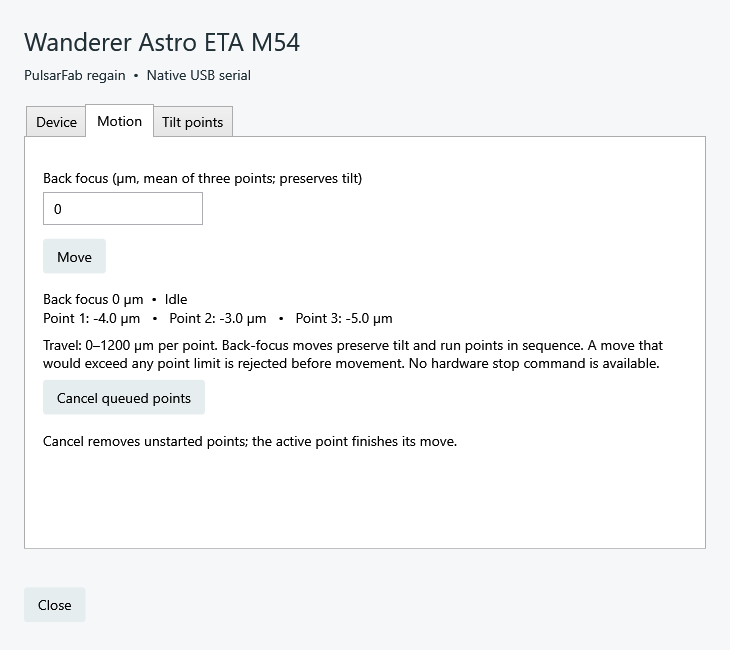

# Wanderer Astro ETA M54

Adjust back focus while preserving tilt, or move one of the three tilt points.
`regain-device wanderer eta` speaks directly to the ETA's serial port without a vendor SDK,
Wanderer Empire, or the vendor ASCOM driver.

**Availability:** current source and CI builds. ETA is not in release 0.4.0.0.
The attached M54 has been identified and read on Windows through the Rust worker,
Alpaca, and shared 32/64-bit ASCOM clients. Movement is tested in
simulation; physical movement validation is pending. M92 support is not claimed.

## Choose a connection

| Connection | Select | Control |
| --- | --- | --- |
| Native NINA plugin | **PulsarFab regain Wanderer Astro ETA M54** under focusers | Back focus; setup gear for individual points |
| Native Windows ASCOM | **PulsarFab regain Wanderer Astro ETA M54** under focusers | `ASCOM.Regain.ETA.Focuser`; shared serial server for 32/64-bit clients |
| Alpaca | Add an ETA under **Focusers and tilt** | `/setup/focusers`; independent slots for each device |
| Rust | `regain-wanderer::eta` library or `regain-device wanderer eta` worker | Absolute point targets, telemetry and back focus |

Regain uses the focuser interface for common back-focus movement. Position is
the mean of the three encoder readings, rounded to whole micrometres (µm), with
the reported focuser coordinate bounded to 0–1200. Step size is 1 µm. Individual
point readings remain available in status, including small negative readings
near the zero limit.

Each point travels 0–1200 µm. A back-focus move shifts all three targets by the
same amount, rounding each to 1 µm. Regain checks every target before writing
anything, then moves points sequentially. Tilt reduces the available common
travel: a request within the focuser range can still be rejected if one point
would exceed its limit. Completion requires three readings within 2 µm of the
target and at least 500 ms since its command; a 60-second timeout faults the
session and discards unstarted moves. No uncertain command is automatically
retried. These completion rules still need physical movement validation.

**There is no documented stop command.** ASCOM/Alpaca `Halt` reports not
implemented. **Cancel queued points** removes movements that have not started;
the active point continues. Cancelling a NINA move does the same, so a cancelled
back-focus adjustment may leave only some points changed. Inspect all three
positions before continuing. No homing or automatic tilt-analysis routine is
provided.

## Setup

1. Connect USB and install the CH340 serial driver if your OS needs it. Keep the
   serial driver; do not replace it with WinUSB.
2. Disconnect Wanderer Empire and other serial clients. Select the ETA port
   in regain's setup and connect. Discovery only listens for M54 telemetry.
3. Check all three positions before moving. Use **Motion** for back focus and
   **Tilt points** for individual absolute targets.

The tested device is CH340 `1A86:7523`, attached as COM3. It provides no unique
hardware serial in the protocol. The saved selector is the **port path**;
verify selection after moving USB cables or connecting another adapter. Regain
verifies the M54 identity but cannot distinguish two M54 units on swapped ports.
On Linux/macOS select the discovered serial path and grant the OS serial-port
permission. Physical validation on those platforms is pending.

All regain ASCOM clients share one local server and one Rust worker. Disconnecting
one client leaves the others connected; the last disconnect releases the port.
NINA's native provider, Alpaca and vendor software remain separate owners, so
disconnect one before using another. No general serial-sharing service is installed.



Actual production WPF controls, rendered offscreen with read-only telemetry from
the physical M54 on COM3, firmware 20260804. No simulated values or movement.

## Worker and actions

```powershell
cargo build -p regain-device
./target/debug/regain-device.exe wanderer eta list-details
./target/debug/regain-device.exe wanderer eta status --serial COM3
./target/debug/regain-device.exe wanderer eta serve --serial COM3
```

`--serial` is the common accessory-worker selection argument; for ETA its value
is a port path. `--simulate --serial SIMULATION` uses a simulated ETA.

The worker accepts one JSON object per line and returns `{ "ok": true,
"result": ... }` or `{ "ok": false, "error": "..." }`. Commands:

```json
{"command":"identity"}
{"command":"status"}
{"command":"move","position":500}
{"command":"move-point","point":2,"position":510}
{"command":"cancel-queued"}
```

NINA, ASCOM and Alpaca expose `Regain.Status`, `Regain.Identity`,
`Regain.MovePoint` (JSON parameters `{"point":2,"position":510}`), and
`Regain.CancelQueued`. Positions and command targets are in µm; point numbers
are 1–3. There is no temperature sensor or temperature compensation interface.

## Protocol and evidence

The [manufacturer's software and manuals page](https://www.wandererastro.com/h-col-106.html)
provides the ETA M54 serial protocol (2025-03-18) and manual (2025-07-27).
Serial is **19200 baud, 8N1**, no flow control, DTR/RTS disabled. Status streams
without a query. Observed on the attached device:

```text
WandererTilterM54A20260804A-0.004A-0.003A-0.005A1A\r\n
```

The fields are model, firmware, three encoder positions in **mm**, then optional
firmware-specific fields. The extra `1` is preserved as opaque telemetry;
regain does not assume that it means ready or moving.

The wire command is the point number followed by an absolute target in mm and
a newline: point 3 at 1125 µm is `31.125\n`. No acknowledgement or stop command
is documented. Writes are generated from validated integers, never raw input.

See [passive trace](eta-serial.jsonl) and [validation record](eta-evidence.json).
`scripts/inspection/eta_probe.ps1` reproduces the passive trace without writing
to hardware. The installed vendor driver's filename is M92, while the attached
device identifies itself as M54; regain targets the observed M54 protocol.

Reproduce the physical read-only integration checks (no motor commands):

```powershell
python scripts/test-eta.py --read-only-port COM3
./scripts/test-eta-ascom.ps1 -ReadOnlyPort COM3
```

See [multiple Alpaca focusers](focusers.md) for stable device numbers and existing-profile migration.
