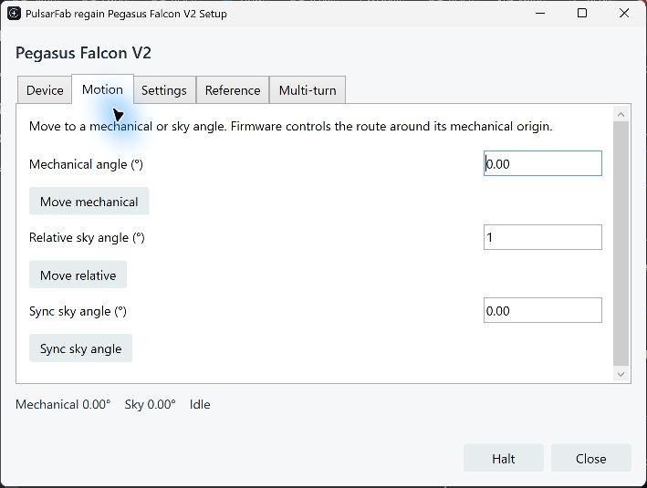

# Pegasus Astro Falcon Rotator V2

`regain-pegasus::falcon` speaks directly to the Falcon V2 USB serial port.
The same Rust driver powers native NINA, native Windows ASCOM, and the
universal Alpaca server. Pegasus Unity and the vendor SDK are not required.
This is current-source, experimental support; it does not cover Falcon V1.

**Hardware tested:** firmware 1.8, revision A, on Windows. Tests passed for
short moves, crossing zero, +450° and −450° travel, halt during motion,
origin reset, reverse, repeated reconnects, native NINA, Alpaca and shared
32/64-bit ASCOM clients. See the [test record](falcon-v2-evidence.json) and
[serial trace](falcon-v2-serial.jsonl). Linux/macOS hardware testing is pending.



## Choose a connection

* **Native NINA:** choose **PulsarFab regain Pegasus Falcon V2** under rotators.
  Its setup gear opens the same themed rotator dialog used for CAA. Select the
  USB serial, connect, and use Motion, Settings or Reference.
* **Native ASCOM:** choose **PulsarFab regain Pegasus Falcon V2** in the Rotator
  Chooser. ProgID: `ASCOM.PulsarFab.Regain.FalconV2.Rotator`. The installer adds
  **Falcon V2 setup** to the Start menu. It supports 32-bit and 64-bit clients
  through `Regain.Pegasus.ASCOM.exe`, which also hosts FocusCube3.
* **Alpaca:** run `regain-alpaca --port 11111`, open
  `http://127.0.0.1:11111/setup/rotators`, add a **Pegasus Falcon V2** slot,
  find the device and select its USB serial. The slot gets a stable rotator
  number and UUID. Add more slots for additional Falcons or CAAs; device
  numbers identify instances, not models. Existing CAA slot 0 keeps its URL
  and UUID when upgrading.
* **Rust/CLI:** embed `regain_pegasus::falcon::Rotator<T>` with a `Transport`,
  or use the common worker:

  ```text
  regain-device pegasus falcon list-details
  regain-device pegasus falcon status --serial USB_SERIAL
  regain-device pegasus falcon serve --serial USB_SERIAL
  ```

Windows uses its built-in USB serial driver; do not replace it with WinUSB.
Disconnect Unity's device connection first: its background server can retain
the port after closing the window. Selection follows the USB serial, not a
particular COM number. Linux needs permission to open `/dev/ttyACM*`; macOS
uses the enumerated USB modem port. Physical Linux/macOS validation is pending.

ASCOM clients share one Falcon serial worker with independent connection
leases. Disconnecting one client leaves the others connected; the last
disconnect stops motion and releases the port. Setup keeps its connection
while open. Alpaca clients share its worker using distinct ClientIDs. Native
NINA, ASCOM, Alpaca and Unity still need exclusive ownership relative to one
another. Use NINA's ASCOM connection when sharing with other ASCOM clients.

## Angles and origin

Normal rotation uses mechanical angles in `[0, 360)`. Firmware chooses the
route around the mechanical origin. `Sync` changes the sky angle without
moving or changing mechanical zero. Reverse changes the motor direction in firmware while preserving the current
reported sky angle. Regain does not negate angles again in software. Reported angles have 0.01° resolution;
this is not a claim of measured positioning accuracy.

**Set reference** and **Reset origin** relabel the current mechanical position
without moving. They also change where firmware applies its cable-wrap
routing. **Multi-turn** is an explicit operation that travels in segments of
at most 90°, resetting the reference between segments. It accepts up to
±450° and bypasses normal cable-wrap protection. The native dialog requires
the user to check clearance and cable slack before starting it.

ASCOM and Alpaca expose `Regain.Falcon.Status`, `Settings`, `Identity`,
`SetReference`, `ResetOrigin` and `RotateUnwrapped` actions. `SetReference` and `RotateUnwrapped` take JSON such as `{"degrees":90}`; reset takes no
parameters. Standard rotator moves, halt, sync and reverse use their standard
interface members. Speed/microsteps are readable; setters, derotation, Wi-Fi
configuration and firmware updates are not exposed.

Each native frontend saves its sky offset separately under
`%LOCALAPPDATA%\Regain\Rotators\falcon-nina.json` or `falcon-ascom.json`.
Alpaca saves its slot registry in `cameras.rotators.json` and each new slot's
settings in `cameras.rotator-N.json`, beside the `--profiles` file. An unfinished
reference operation marks saved coordinates uncertain; reconnect discards
that offset so the user can sync again. Do not relabel the origin in another
application and assume a previously saved sky offset is still valid.

## Protocol evidence

Sources: Pegasus's [V2 command list](https://pegasusastro.com/command-list-for-falconv2/),
inspection of the installed Unity3 `Peg.Engine.dll` Falcon V2 driver, and
application-level serial query traces from the attached device. No vendor
implementation is copied or bundled. These traces are not USB bus captures.
Inspected DLL SHA-256:
`75a3232e12dfb401f424d80680c10428c0db02985e29d4d9313de0b224fbcbec`.

The application enumerates as USB `303a:9002`, with 115200 baud, 8N1 and DTR
asserted. Requests end in LF; replies accept LF or CRLF. The worker validates
the `F2R_…` identity before accepting a device. The bootloader PID `0002` is
excluded. RTS is explicitly asserted for Falcon; repeated opens and closes
passed with both control lines asserted. FocusCube3 retains its existing
control-line settings while sharing the bounded serial framing implementation.

| Request | Physical reply, identifying suffix redacted | Meaning |
| --- | --- | --- |
| `F#` | `F2R_<6 hex digits>_A` | V2 identity, revision A |
| `FV` | `FV:1.8` | Firmware |
| `FA` | `F2R:0.00:0:4500:4:0` | Angle, moving, speed, microsteps, reverse |
| `FD` | `FD:0.00` | Mechanical angle |
| `FR` | `FR:0` | Idle |
| `FS` | `FS:4499` | Speed query; differs from aggregate status |
| `FU` | `FU:283` | Uptime |

Hardware-validated motion commands are `MD:<angle>`, `SD:<reference>`,
`FN:0/1` and `FH` (halt acknowledgement `FH:1`). The serial trace records
moves, reference changes and halt; the integration tests also exercise reverse.
The driver serializes exchanges, bounds replies and deadlines, and never
replays an uncertain write. Invalid acknowledgements or failed motion latch
a session fault requiring reconnect. Halt clears remaining multi-turn
segments before checking the device, so it cannot start another segment. A
failed exchange during motion attempts one best-effort halt; its reply cannot
prove a stop after framing is lost, and reconnect remains required.

## Verification

```text
cargo test -p regain-pegasus
python scripts/test-alpaca-falcon.py
pwsh -File scripts/test-falcon-ascom.ps1
```

Simulation is explicit. Hardware integration tests require an explicit USB
serial: `test-alpaca-falcon.py --hardware-serial USB_SERIAL` rotates ±450°,
halts, resets origin, and tests reconnects. Run only with suitable clearance.
