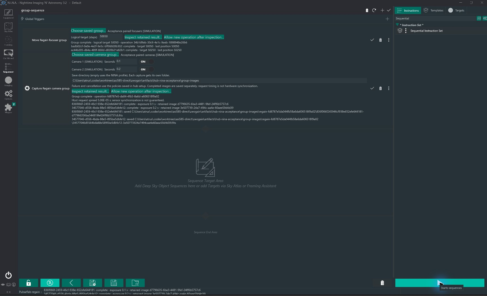
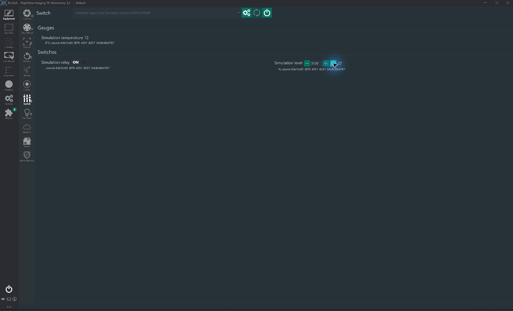
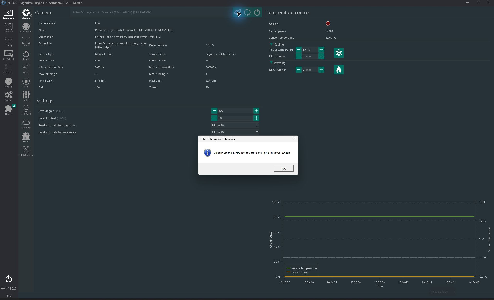
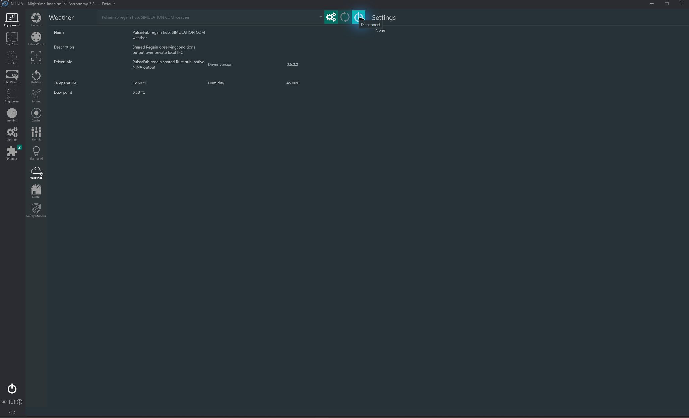
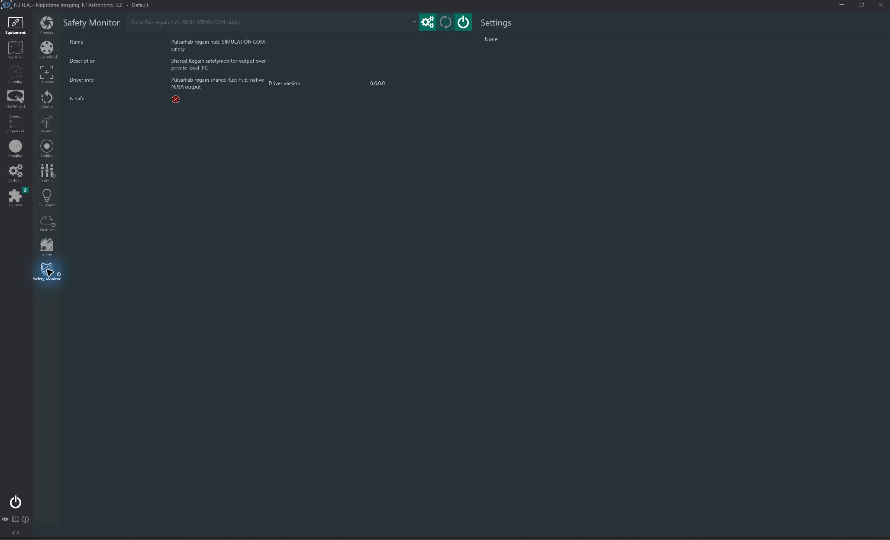

# Hub construction evidence and remaining acceptance

This supplements [the original plan](hub-plan.md); it does not replace its scope
or waive its gates. Checked construction items mean the feature exists and has
the stated local coverage. They do not establish installed-client, physical,
portable OS or external conformance acceptance. Final completion is unproven.

Installer fixture expansion, 2026-10-07: all eight classes now have independent
registrations in two installations. The disposable-runner workflow checks both
client bitnesses' metadata activation before/after upgrade and preserves saved
config/binding hashes through uninstall and other-install isolation. Five local
file-only tests and PowerShell parsing pass. The machine-wide installer was not
run locally; installed signing/UAC/Chooser/upgrade acceptance remains open.
The in-use NINA session and its connected devices were left alone.

## Construction audit, 2026-10-07

The audit inspected current implementations and test assertions, then matched
them to retained local results. It found and fixed the missing camera/panel
ProgID self-proxy checks. No broad regression was repeated merely to update a
checkbox. Test sources below are reproducible evidence; artifact logs are local
records, with their results described in [the review](hub-review.md).

| Original item | Current implementation and relevant tests | Audit result |
| --- | --- | --- |
| 2: native workers and bounded Alpaca adapters | [factory](../crates/regain-hub/src/factory.rs), [native](../crates/regain-hub/src/native.rs), [Alpaca](../crates/regain-hub/src/alpaca.rs); [native tests](../crates/regain-hub/tests/native.rs), [Alpaca tests](../crates/regain-hub/tests/alpaca.rs) | Implemented. Fresh mixed-source test explicitly supplies the built production worker directory and uses simulation. |
| 2: stable mappings, duplicates/cycles, shared leases | [configuration](../crates/regain-hub/src/config.rs), [source actors](../crates/regain-hub/src/source.rs); [configuration tests](../crates/regain-hub/tests/config.rs), [source tests](../crates/regain-hub/tests/source.rs) | Implemented. Removal/reload/readdition cannot reuse numbers; source/channel retargeting and cycles fail; only final owned release disconnects. |
| 2: combined Switch channels | [Switch](../crates/regain-hub/src/switch.rs), [Switch tests](../crates/regain-hub/tests/switch.rs) | Implemented. Slots/tombstones, gauges, permissions, step/range checks, command ownership and fresh readback after acknowledgement are covered. |
| 2: SafetyMonitor and weather semantics | [safety engine](../crates/regain-hub/src/safety.rs), [safety output](../crates/regain-hub/src/safety_output.rs), [weather](../crates/regain-hub/src/weather.rs); [source tests](../crates/regain-hub/tests/source.rs), [weather tests](../crates/regain-hub/tests/weather.rs) | Implemented. Independent expiry/confirmation/counters, AND, fresh recovery, generation fencing, units, per-metric fallback, sensor age and averaging are covered. |
| 2: Alpaca publication and shared setup | [HTTP tests](../crates/regain-alpaca/tests/hub_output.rs), [executable tests](../crates/regain-alpaca/tests/hub_host.rs) | Implemented. Dynamic discovery, scalar mapping, independent clients, cached safety/weather, protected revision-checked setup and accessory-only startup are covered. |
| 2: mixed inputs and failure/multi-client tests | [mixed-source test](../crates/regain-hub/tests/alpaca.rs), [runtime tests](../crates/regain-hub/tests/runtime.rs), [source tests](../crates/regain-hub/tests/source.rs) | Implemented. Explicit production-worker simulation plus HTTP shares temperature across Switch/weather; stalled I/O, uncertain writes, disconnect order and persisted identities have focused coverage. |
| 3: direct NINA and shared source ownership | [native provider tests](../tests/Regain.NINA.Tests/HubNativeTests.cs) | Provider/process coverage exists, including operation before starting an HTTP publisher and shared leases afterward. Installed NINA and an environment without installed ASCOM Platform remain unverified. Keep the two original verification items open. |
| 4: native ASCOM output construction | [output server](../src/Regain.Hub.ASCOM/ExportServer.cs), [typed outputs](../src/Regain.Hub.ASCOM/CameraOutput.cs), [shared setup](../src/Regain.Rotator/Hub/HubConfigurationWindow.cs); [export fixtures](../scripts/test-hub-exports.py) | All eight classes are implemented through private IPC with shared setup. Real net48 x86/x64 fixtures and external native COM runs exist. Installed registration/upgrade acceptance remains separate. |
| 4: broader typed inputs/outputs | [runtime](../crates/regain-hub/src/runtime.rs), [COM imports](../src/Regain.Hub.ASCOM/ImportDriver.cs), [camera import](../src/Regain.Hub.ASCOM/CameraImport.cs), [native NINA](../src/Regain.NINA/HubCamera.cs) | Focuser, Rotator, FilterWheel, CoverCalibrator and Camera inputs/outputs are implemented in the common runtime. Native, remote, COM, virtual and explicit simulation paths have class-specific fixtures. |
| 4: camera lifetime, transport, capabilities and acquisition ownership | [camera contract](hub-contract.md), [image tests](../crates/regain-hub/tests/camera_image.rs), [acquisition tests](../crates/regain-hub/tests/camera_acquisition.rs), [managed image tests](../tests/Regain.NINA.Tests/HubImageTests.cs) | Implemented. Immutable pinned images, shared memory budget, exact numeric/rank/order preservation, bounded protected transport and explicit acquisition ownership are covered. Proxy inputs acquire no native reread guarantee. |
| 4: controlled PulseGuide and frontends | [guide tests](../crates/regain-hub/tests/support/camera_guiding.rs), [HTTP camera tests](../crates/regain-alpaca/tests/support/hub_camera_output.rs), [ASCOM camera](../src/Regain.Hub.ASCOM/CameraOutput.cs), [NINA camera](../src/Regain.NINA/HubCamera.cs) | Implemented. Capability checks, retained guide control, exposure interaction, cancellation/lost reply and no replay are covered. |
| 4: recovery metadata compatibility | [core recovery](../crates/regain-core/src/recovery.rs), [shared contract](../contracts/camera-recovery.json), [legacy tests](../tests/Regain.Tests/RecoveryConfigurationTests.cs), [native form tests](../tests/Regain.NINA.Tests/CameraRecoveryConfigurationTests.cs) | Implemented. Fourteen shared descriptors retain keys/defaults/PascalCase format, strict bounds and hidden platform values; frontend behavior uses the existing capture engine. |
| 4: dynamic identity across installed registration/upgrades | [registration tests](../tests/Regain.NINA.Tests/HubRegistrationTests.cs), [installer fixture](../scripts/test-hub-installer.py) | Private identities, both views, collisions, ownership and rollback have coverage. Installed signed upgrade/UAC/Chooser acceptance remains open; the disposable-runner installer fixture is deliberately not run against this user's installation. |
| 4: external conformance and multi-client acceptance | [conformance record](hub-conformance.md) | Runs exist for all eight classes and both native server bitnesses. Focuser/sparse-bin findings remain failing in raw results; one panel timing finding is retained despite an isolated pass. This gate is not declared passed. |
| 5: calibrated focusers and separate camera results | [coordination contract](hub-coordination.md), [group code](../crates/regain-hub/src/coordination.rs), [NINA focuser instruction](../src/Regain.NINA/MoveHubFocuserGroup.cs), [NINA camera instruction](../src/Regain.NINA/CaptureHubCameraGroup.cs), [sequence tests](../tests/Regain.NINA.Tests/HubCameraSequenceTests.cs) | Construction is implemented with existing simulation/fault/FITS evidence. Actual installed NINA and physical coordination acceptance remain open; no rollback or sensor synchronization is claimed. |

Retained baseline results: `hub-resume-regression.log` (hub/Alpaca suite),
`hub-recovery-rust.log` (core/Alpaca), `hub-recovery-core-suite.log` (96 managed
core), `hub-recovery-nina-suite.log` (516 passed, one explicit registered-COM
skip), and `hub-recovery-net48-verified.log` (both complete net48 suites).
These logs predate the self-proxy correction. Its new evidence is
`hub-audit-self-proxy-green.log` (24 configuration cases),
`hub-audit-managed-identities.log` (24 registration/identity cases),
`hub-audit-clippy.log` and `hub-audit-msrv.log`. The fresh mixed-source proof and
worker hash are `hub-audit-mixed-source.log` and `hub-audit-native-provenance.json`.

## Acceptance still needed

| Gate | Evidence required to close it | Current boundary |
| --- | --- | --- |
| Installed native NINA | Actual plugin load/chooser/setup and device/group operations, with exact application version; direct use without HTTP and native/network use without installed ASCOM Platform | NINA 3.2.0.9001 passes all eight native classes, both coordinated instructions, shared setup and explicit host-loss reconnect using labeled simulation without HTTP. Separate COM-source weather/safety isolation also passes. An environment without ASCOM Platform remains unverified. See the 2026-10-09 records below. |
| Installed COM/installer lifecycle | Actual signed payloads, Chooser/UAC, x86/x64 activation, owned registration preservation through upgrade/uninstall, profile compatibility | Private registry/export and installer construction coverage does not prove this. |
| Mixed physical inputs and sharing | Identify idle, authorized hardware; exercise native/network/COM combinations, short safe operations, disconnect/reconnect, per-client command conflicts and recovery | Installed NINA now exercises the physical ASI585MM Pro through direct USB alongside explicit COM weather and loopback Alpaca safety fixtures. Exact image parity, both frontend disconnect directions, command conflicts and source-failure isolation pass. This covers the tested mixed path; physical multi-device coordination and interrupted-download recovery remain separate acceptance work. |
| Real sleep/wake | Actual suspend/resume on supported OSes, independent safety/weather withdrawal, session reconnect, uncertain-command fencing and retained image behavior | Injected clocks and Windows/Linux/macOS implementation checks exist; real OS acceptance is open. |
| Real LAN/scoped IPv6 | Separate-host routing/discovery plus actual scoped IPv6 interface use, with host/interface identities and failure behavior recorded | Production Windows Hub traffic now crosses the Debian WSL2 virtual NIC over IPv4 and actual link-local IPv6 scope 63: pinned catalogs, exact shared images and safety withdrawal on remote loss pass, with peer identities and cleanup recorded. This same-machine, cross-kernel simulation advances scoped routing evidence; physical LAN, UDP discovery and TLS on that LAN remain open. |
| External standards findings | Resolve or explicitly accept the recorded standards discrepancies without suppressing raw failures; retain the panel timing evidence and investigate its cause | Original raw findings remain visible. The panel getter uses one cached IPC read. Three fresh clients of the unchanged ConformU facade measure first reads at 17.79–29.13 ms and split getters below 3.58 ms; this does not reproduce/explain the original 139 ms finding, which remains open. |
| Documentation/publication | Final release copy, README/setup/site consistency, correct stable/preview boundary, screenshots, then publish the companion site | Website main/deployment now serves 57dff44: stable 0.5.11 corrections and a separate 0.6 Hub preview with honest screenshot captions. Fresh generation/27-page link checks pass; all 29 live documents match checked source apart from recorded host injections, and four image HEAD sizes match. Prior inspected desktop/mobile renders are retained. Final 0.6 release-copy alignment remains open; no Hub package/feed was published. |
| Final reconciliation/review/CI/merge | Fresh main, full requirement audit, relevant final local regression, final CI/review, then merge the single PR #21 | Main is integrated through merge 351c751, including retry diagnostics and exact internal package versions. Local core/Hub/Alpaca suites pass 849 tests; NINA passes 532 with one explicit COM-fixture skip. CI 37983930950 tests production/test code at 7e6d2bb; its result is pending at this checkpoint. PR remains draft; the original environment and conformance gates are still open. |

## Installed native NINA acceptance, 2026-10-09

Actual NINA **3.2.0.9001** loaded the 0.6 development plugin from its installed
plugin directory. A production Rust Hub supplied ten saved outputs across all
eight device classes, using explicitly labeled built-in simulation. The host
used private local IPC; no HTTP publisher was running. These results establish
installed frontend behavior, not physical device or ASCOM-free OS acceptance.

| Installed NINA operation | Observed result |
| --- | --- |
| Camera | Connected the saved output, displayed a 320 × 240 monochrome 16-bit frame and saved a 0.1-second FITS exposure. After the metadata fix, `INSTRUME` is `Regain simulated sensor` and `CAMERAID` is the complete output UUID. |
| FilterWheel | Selected Blue and applied the change; source readback confirmed position 2. |
| Focuser | Moved from 50000 to 50025 and read the resulting position in NINA. |
| Rotator | Set mechanical angle to 15 degrees and read 15 degrees back. |
| CoverCalibrator | Set brightness to 1200 of 4096, turned the light off, opened the cover and completed a close command. |
| Switch | Displayed the read-only temperature gauge, switched a relay on and applied/read back an analog level of 37. |
| ObservingConditions | Displayed 12 °C and 1013 hPa. |
| SafetyMonitor | Started unsafe, became safe after the configured fresh-observation hold, then became unsafe after an injected source read failure. |
| Focuser group instruction | The actual Advanced Sequencer completed a group target of 50050; member readbacks were 50050 and 50250 with the configured offset of 200. |
| Camera group instruction | The actual Advanced Sequencer saved two separate 320 × 240 FITS files at 0.1 and 0.2 seconds, with the upstream model and distinct source UUIDs in their headers. |
| Shared setup | Connected setup now shows a disconnect-first notice while preserving the camera connection. After disconnect, saved outputs load and the common configuration editor opens within NINA. |
| Host loss | Stopping the owned Hub disabled camera controls. Explicit reconnect started a new host and connected the same saved output; NINA closed normally afterward. |

The pass found two product defects and verified their fixes in the installed
plugin. Native Hub camera downloads omitted camera metadata; each accepted
capture now retains its upstream sensor/model name and compact output UUID.
Using the UUID also avoids NINA's FITS writer truncating the longer chooser ID.
Connected setup threw an exception on NINA's unhandled pool thread, terminating
the application. Setup now dispatches WPF work to the UI thread, reports blocked
or failed setup visibly, and preserves the active binding if a connection
changes while the editor is open.

The focuser group instruction's blank palette icon was also traced to the
nonexistent `FocuserSVG` resource. It now names NINA's installed `FocusSVG`
resource. The retained group screenshot predates this cosmetic correction.

Fresh focused coverage passes four camera capture cases (SDK simulation, direct
USB simulation, ASCOM fixture and nested Hub fixture), four typed-output setup
cases including a connection change during setup, and two setup error/disposal
cases invoked from a pool thread. The Release build succeeds without warnings.
The pre-fix missing FITS headers and fatal setup exception remain in the local
record; neither is treated as an earlier pass.

Evidence is retained in `artifacts/hub-nina-acceptance/`: configuration and
bindings, installed binary hashes, source readbacks, group sequence and images,
FITS headers, NINA logs, screenshots and regression results. The Switch screenshot
contains a malformed degree symbol caused by this fixture's initial text
decoding; weather and camera UI show the correct unit. No product unit change
was required. The stable signed **0.5.12.0** plugin was restored with all 241
backup files matching hashes. Temporary frontend bindings and the development
installation were preserved outside the plugin directory, and the owned test
host was stopped.

Physical mixed-source testing, machine-wide ASCOM activation/installer testing,
an OS without ASCOM Platform, real suspend/resume and the other acceptance gates
above remain open. PR #21 remains a development draft; this pass publishes no
Hub release.

## Installed NINA and COM weather regression, 2026-10-09

NINA 3.2.0.9001 loaded the current 0.6 development plugin from its actual plugin
directory. One production Rust Hub ran in local-IPC-only mode. Three explicitly
labeled private COM fixtures supplied x64 weather and Switch inputs and an x86
safety input; no vendor driver, physical device or HTTP publisher was used.

Native weather displayed 12.5 °C, 45% humidity and 0.5 °C dew point. Injecting a
humidity failure removed only that measurement. Stalling `IsSafe` changed NINA to
unsafe while weather remained available; clearing the stall restored safe after
fresh observations. Switch displayed its upstream level. Its shared temperature
gauge correctly remained unavailable: the fixture's 3.5-second sensor age exceeds
the configured 3.1-second Switch freshness bound. This is not a successful
fresh-gauge or writable-channel acceptance test.

NINA also connected through the bound native ASCOM weather output, displaying
the same healthy values and preserving temperature/dew point during a humidity
failure. Native Switch and safety remained connected. The weather trace retains
one upstream worker PID across the native-to-ASCOM handoff, demonstrating shared
source ownership. This output test required explicitly starting the bound COM
server. SCM activation with the private HKCU registration returned
`REGDB_E_CLASSNOTREG`, including after removing the machine-only `RunAs` fixture
value. A separate fresh private `test-hub-exports.py --scm` attempt also failed
at metadata activation. Production cold activation uses machine registration;
`test.ps1` deliberately restricts that test to disposable Windows CI. This local
fixture does not prove production machine registration or installer acceptance.

Local evidence is in `artifacts/hub-installed-nina-20261009/`: installed binary
hashes, exact configuration/bindings, upstream traces, NINA log and screenshots.
NINA closed normally; owned host/server/workers stopped, private COM and Chooser
entries were removed, and temporary frontend bindings were retired. The signed
0.5.12.0 stable plugin then replaced the development build, with matching package
hashes. Existing camera/recovery settings and other installed plugins remain.

The CI failures were canonical `SensorName` parameters rejected by the importer's
lowercase-only whitelist. The importer now canonicalizes known names using
ordinal case-insensitive comparison; unknown names and arbitrary COM members
remain rejected before dispatch. The new worker regression covers every weather
sensor and empty/all-sensors queries in both bitnesses, including invalid types
and whitespace. It fails 52 subcases before the fix. `test-hub-com.ps1` then passes
35 worker tests, all 26 registered-COM parent tests and eight NINA camera-import
tests. No timeouts, freshness limits or failing assertions were relaxed.

## Independent external Alpaca application

Installed ASCOM OmniSimulator
`0.5.0+1c01cfc6660e71c336291261dba7806028129659` on loopback port 32323
was exercised through a private production Hub with pinned identities. The
[harness](../scripts/test-hub-omnisimulator.py) preserves the original app settings
and requires idle/disconnected inputs. The current external record is
`hub-omnisimulator-cf7a88dcdce04e84b29ce834670c1c7d/summary.json`.

Seven classes pass their exercised operations: scalar Switch, safety and weather
readback; focuser/rotator/panel readback; and camera acquisition. The Switch also
combines an explicit native FocusCube3 worker simulation with the external
network channel. A 32×24 camera exposure preserves all 768 pixels across JSON,
ImageBytes and two clients; disconnecting the first preserves the second's
connection and exact image reread. This does not test physical camera recovery,
device motion, installed NINA/COM or a real LAN.

The eighth class remains rejected: the wheel's six focus offsets contain no
required zero reference. No reference was fabricated and the overall command
returns failure. The record verifies restored camera settings, released owned
leases, all eight upstream devices disconnected after asynchronous completion,
and both owned processes stopped. The pre-existing simulator remains running.

This slice fixed shared-ClientID failure isolation and canonical weather sensor
parameters; local regression and review evidence are in [the review](hub-review.md).
It advances external application acceptance without closing the all-class or
original final acceptance gates.

## Physical camera with COM and network sources, 2026-10-09

Installed NINA **3.2.0.9001** loaded the 0.6 development plugin against the
production Hub at `7e6d2bb` (production binaries built from merge `351c751`).
The physical **ZWO ASI585MM Pro**, serial `2805960a19020900`, used the direct
USB backend with SDK fallback disabled. The other inputs were explicitly labeled
fixtures: x64 COM weather and a separate loopback Alpaca safety publisher.
These weather/safety observations do not establish physical sensor or LAN acceptance.

NINA connected before the main Hub's HTTP publisher started. The publisher was
then started for sharing checks. NINA's 0.1-second, 3840 × 2160 FITS image records `INSTRUME='ZWO ASI585MM Pro'`
and the complete output UUID as `CAMERAID`. All **8,294,400 pixels** match the
subsequent Alpaca ImageBytes response after converting FITS row order and signed
storage. Repeated downloads retain identical pixels. A later 64 × 64 physical
exposure also matches JSON and ImageBytes exactly.

With NINA and Alpaca connected together, the physical source reports two leases.
Disconnecting NINA preserves the Alpaca connection and exact retained image.
After reconnecting NINA, disconnecting Alpaca preserves NINA's connection and
another successful full-frame capture. Two additional Alpaca clients reject a
competing exposure and geometry setter with busy errors; releasing the capture
owner preserves the other client's image. Geometry is restored afterward.

COM weather displays 12.5 °C, 45% humidity and 0.5 °C dew point alongside the
physical camera. Injecting a humidity error removes only humidity; NINA still
saves another physical capture. Stopping only the owned upstream Alpaca publisher
changes NINA safety from safe to unsafe while weather and the physical camera
remain connected. Restarting that publisher restores safe after fresh confirmation.
The upstream fixture retains its default confirmation and recovery policies;
the test does not shorten them to bypass recovery.

Local evidence is retained in `artifacts/hub-final-physical/`: exact configuration
and bindings, binary hashes, NINA log, FITS headers, ImageBytes, source/lease
readbacks, conflict replies and process cleanup. Initial harness mistakes
(reading FITS pixels before stopping at END, comparing different array orders,
querying without a client lease, and requesting a 48-pixel-high ROI below the
direct driver's 64-pixel minimum) are retained and corrected. They are not
reported as successful checks or product fixes.

NINA closed normally. Owned hosts/publishers and private COM fixtures were
retired; temporary frontend bindings and the development installation were
preserved outside the active plugin directory. The newly published, signed
**0.5.13.0** stable plugin is installed, with all **241 files** matching the
verified release package. SDK inspection afterward confirms cooler off and
the original target temperature unchanged.

The separate **0.5.13.0** release passed signing, installer and package checks;
its manifest is live on both public NINA registry addresses and all nine Rust
crates are published at 0.5.13. This does not publish the 0.6 Hub. The user reports
that an ASCOM-free Windows system and a second LAN host are not yet available.
Those checks, actual OS sleep/wake, outstanding external standards findings,
physical coordination/recovery and final Hub installer/release audit remain open.
PR #21 remains draft.
