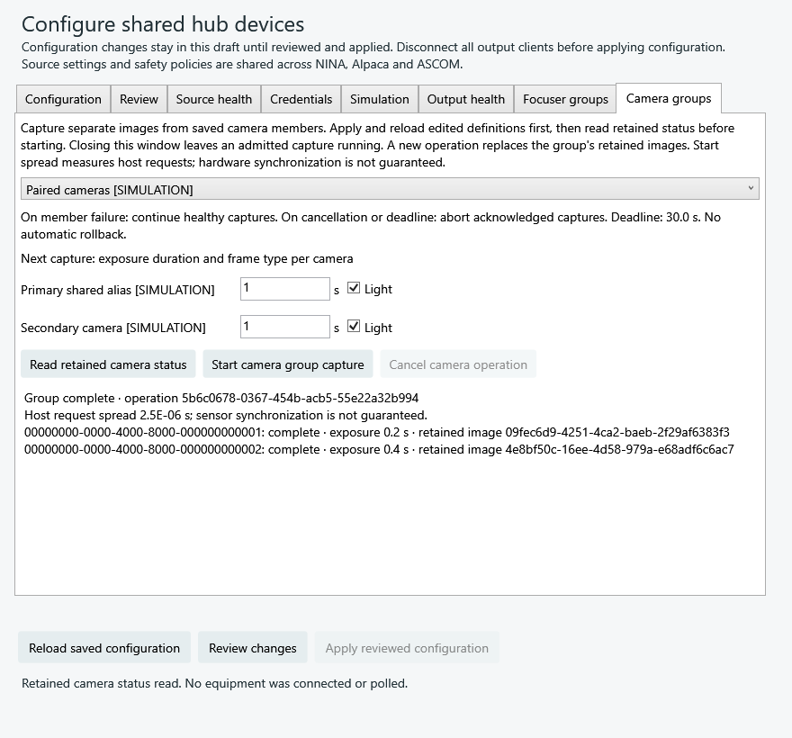

# Explicit hub coordination

Status: development on `codex/regain-hub`. Focuser groups have shared saved
configuration, host-owned IPC operations, native setup controls and a native NINA
sequence instruction. Camera coordination and the overall acceptance gates remain
open. No new standard single-device interface or hardware synchronization promise
is introduced by coordination.

## Focuser groups

Use a group when several absolute focusers must follow one logical position with
different steps, directions or offsets. Each member keeps its own target,
transport generation, observed position, phase and error. A completed group means
every member reported stopped at its exact target. An acknowledged Move alone is
not completion.

The current Rust API accepts already connected, resolved `FocuserSession`s. It
uses the same source actors, generation fences and control leases as ordinary
typed drivers. Construction and reading operation status perform no source I/O.
It does not add a device crate, transport or standalone process.

### Calibration and admission

For each member:

```text
device target = round(logical target × scaleNumerator / scaleDenominator) + offset
```

The denominator is positive; the numerator is nonzero and may be negative.
Rounding uses nearest integer with ties away from zero. Integer arithmetic avoids
floating-point calibration drift. The result must fit Int32 and the member's
configured inclusive travel bounds. Logical bounds, all transformed targets,
unique nonempty source IDs and configuration bounds are checked before I/O.

A group has 2–32 distinct sources, a finite 0.01–300 second operation bound and a
0.01–10 second completion observation interval. The deadline starts at admission,
including time before the owned task runs. It does not alter source poll/recovery
settings or shorten the source's existing in-flight mutation deadline.

The controller reserves every member's existing command lease before any Move.
All members must pass live preflight: absolute positioning, valid capabilities,
stopped motion, current/target travel, per-move `MaxIncrement`, and temperature
compensation disabled when supported. It never disables compensation, homes,
reconnects, chunks a large movement or probes Halt implicitly. Overlapping groups
fail Busy rather than wait for one another's partially held leases.

Every member is checked again immediately before its dispatch. External software
or physical changes can still change equipment outside Regain's command leases;
preflight does not provide an atomic hardware transaction.

### Dispatch, cancellation and partial results

Moves are dispatched once in configured order. The controller stops dispatching
later members after rejection, ambiguous acknowledgement, explicit cancellation
or deadline. Motions already acknowledged may overlap; this provides no hardware
synchronization guarantee. Started siblings continue to be observed after a
member fails. Each member polls independently, so a hung read cannot delay a
healthy sibling's later completion publication.

The task owns its leases and status independently of a waiting frontend. Closing
or dropping a waiter does not stop it. Explicit cancellation stops further work,
without implying Halt or rollback. If cancellation/deadline arrives during a
dispatched mutation, the task first receives its bounded acknowledgement or
uncertain result. That can extend return beyond the group deadline by the
remaining source operation time, including residence behind already queued actor
work. This is not a promise of return within one backend timeout. It preserves the distinction between a command
that started and one that was never attempted.

Member phases are `notStarted`, `rejected`, `moving`, `complete`, `failed` and
`uncertain`. Group phases are `preflight`, `moving`, `complete`, `preflightFailed`,
`partialFailure`, `cancelled` and `deadline`. A terminal cancellation/deadline may
retain `moving` members: inspect the equipment explicitly before commanding it
again. Lost replies and generation changes remain uncertain, and the underlying
source actor prevents mutation replay. There is no automatic retry or rollback.

Status uses one latest immutable report with stable operation/group IDs and an
increasing publication sequence. Reads do not poll sources or advance sequence.
Handles can subscribe to changes or await a terminal report.

### Saved configuration and host ownership

`HubConfig.focuserGroups` is optional in schema version 1, defaults to an empty
array, and contains at most 64 groups. Each group has an immutable UUID and a
label; calibration, bounds and timing use the generated Rust descriptors in the
browser and native configuration editors. Retired group IDs cannot be reused as
source, output or channel identities. Removing and restoring a group does not
reset identity history. The [paired-focusers example](../crates/regain-hub/examples/paired-focusers.json)
uses only explicit simulations and includes a virtual source alias.

Saved members may reference virtual focuser proxies. Validation follows those
references to physical source leaves and rejects missing/wrong classes, cycles
and repeated leaves before publishing a runtime. Operations use physical source
actors directly; aliases cannot bypass shared command leases. Results retain both
configured-to-physical bindings and each physical member's transport generation.

The host admits work under its runtime lifecycle lock and reserves activity
before spawning. This prevents configuration apply from passing through a pending
connection or admitted move. Status is bounded to the latest operation per group,
including terminal results; a new explicit start retires the previous operation
ID. Host restart or configuration revision replacement clears this inventory and
never resumes equipment work. No persistent operation journal is claimed.

The private IPC commands are `startFocuserGroup(group, target, expectedRevision)`,
`focuserGroupStatus(group, operation?, expectedRevision)` and
`cancelFocuserGroup(group, operation, expectedRevision)`. The `focuserGroups`
capability gates these controls. Status does not connect or poll equipment. Start
returns the admitted operation's identity; losing its reply never causes an
automatic retry. A replacement client can read the latest retained status and
then address that exact operation. Cancellation acknowledges a request, rather
than completed physical motion. Shutdown stops admission, cancels further work,
awaits in-flight acknowledgements and drains source ownership without Halt.

Hosted phases are `connecting`, `running`, `complete`, `preflightFailed`,
`partialFailure`, `cancelled`, `deadline` and `failed`. A connection/capability
failure identifies its physical source even before a core member report exists.
Host instance, revision, operation, calibrated targets and publication sequence
are checked by the managed client before publishing results. An unexpected host
monitor failure cancels its child task and retains an uncertain result; an
independent child activity guard prevents configuration quiescence while that
child is still retiring.

### Native setup and NINA

Add a **Focuser groups** entry in Configuration, choose saved focuser sources and
their calibration, then review, apply and reload. In the **Focuser groups** tab,
select the group, read retained status, enter a logical target and explicitly
start. Read status to inspect member targets, positions and errors. Closing the
window leaves admitted work running; reopening it can inspect that same result.

In NINA's advanced sequencer, add **Move Regain focuser group** from **PulsarFab
regain**, choose a saved group and set its logical target. The instruction uses
local IPC and waits for every member to report its exact target. It needs neither
an ASCOM output nor an HTTP listener. Cancellation requests cancellation only for
its known operation; it never guesses an operation after losing the start reply.
Failed/interrupted steps retain a reconciliation flag through cloning and saved
sequences, so automatic error retry cannot start another move. Inspect the result
and equipment, then explicitly allow a new operation before re-running the step.

### Acceptance and remaining work

Private actor tests cover calibration/reverse/rounding/overflow, preflight across
all members, live limit changes between dispatches, shared lease contention,
overlapping groups, cancellation before admission work and during a held Move,
dropped waiters, exact completion, ignored commands, stalled members, deadlines,
lost acknowledgement without replay, independent sibling observation and source
retirement. No physical focuser or installed vendor driver is used.

Host/IPC cases cover alias deduplication, connection failure, revision fencing,
configuration apply during pending connection, read/unread start-acknowledgement
loss, explicit reattachment/cancellation, superseded operation IDs and shutdown
during a held Move. Managed tests cover malformed results, shared schema/drafts,
actual-host reattachment and member completion, NINA cancellation/failure fences
across save/clone and a rendered WPF panel. These are private fixtures and explicit
simulations, not installed-NINA or physical-device acceptance.

Synchronized cameras, measured start skew, separate images/member results,
abort/continue policy, real OS recovery/resume notifications and the remaining
interactive/physical acceptance, documentation and final merge gates remain work.

## Camera group core

The Rust core now provides explicit camera bursts through the same acquisition
supervisors used by ordinary Camera outputs. Saved configuration and retained
host/status/image IPC, shared native operation controls and managed image access
are implemented. Native NINA capture/image-save orchestration remains required; a standard Camera output still
represents one camera and one image.

A group has a stable UUID, label, two to 32 distinct physical camera source IDs,
a finite whole-operation timeout (0.01 seconds to seven days), an explicit failure
policy and an explicit cancellation/deadline policy. Each start supplies one
exposure request per configured source, matched by identity rather than retargeted
by enumeration. The core accepts already connected sessions; it never opens,
reconnects, resets or changes camera settings implicitly.

Preparation reserves each camera's ordinary acquisition/control ownership and
validates all members before any exposure starts. Every prepared geometry is
rechecked, along with CanAbortExposure if either configured policy may require
abort. A bad member releases unused reservations and prevents the entire burst.
Other camera clients and overlapping groups cannot change settings or capture
through those reservations. There is no await between the one-shot dispatches
to independent source actors. External hardware changes cannot be made atomic.

Each member retains its admitted source, generation, request, acquisition UUID,
host request/acknowledgement window, completion metadata and error. Host dispatch
skew is the maximum-minus-minimum observed request time, published after every
start window is known. It is neither a sensor exposure timestamp nor a promise
of hardware synchronization. A delayed acknowledgement is reported separately.
Independent observers let a healthy member publish while another start or image
is stalled. Lost acknowledgements remain uncertain and are never replayed.

Completed images are pinned at the ordinary supervisor's publication point.
Each group member holds an immutable Arc to that exact image and identity; later
ordinary captures cannot replace it. Pins share the existing image budget and
do not copy pixels or evict other readers. A download, geometry, metadata or
generation failure preserves the supervisor's uncertain ownership and cannot
publish a replacement frame. Healthy sibling images remain available.

On member failure, **continue** lets other started cameras finish; **abortStarted**
requests AbortExposure only for acknowledged acquisitions. Cancellation/deadline
separately chooses **leaveRunning** or **abortStarted**. No policy implies Stop,
reset, rollback, re-exposure or a retry. Cancellation waits for admitted start and
abort acknowledgements under the existing actor bounds. Abort admission checks
the exact acquisition under the supervisor lock, so it cannot abort a later
capture after a group member has completed. A rejected abort during readout is
retained as a separate abort error while the admitted image can still complete;
the group stops waiting at its own deadline. Abort uncertainty remains fenced.

Dropping a group observer does not cancel work. A terminal stopped report is
frozen: with leaveRunning, unfinished captures continue under their ordinary
supervisors, but later completion is not added to the stopped group report.
Reading status performs no equipment I/O or new publication. Starting another
operation requires explicit admission; source ownership still blocks it when a
previous stopped capture remains active or uncertain. An unexpectedly stopped
group task cannot leave observers believing it remains active indefinitely.

Private fault tests cover all-member rejection, required abort capability,
overlapping ownership/settings, live geometry changes, dropped waiters, separate
image pins across later captures, delayed start replies, explicit continue/abort,
cancellation before and during dispatch, later-capture protection, readout/abort
races, deadlines, uncertain abort, image budget and generation loss. No attached
hardware or installed vendor driver is opened. Native NINA capture/save is the
next construction step, followed by the original acceptance
and final merge gates.

### Saved camera groups and retained operations

`cameraGroups` is an optional schema-1 collection, bounded to 64 groups. The
generated contract drives its fields in browser and native configuration editors;
the `cameraGroups` capability gates editing. Both policies are required. Source
references may name typed virtual Camera aliases, which resolve to distinct
physical leaves before the runtime is published. Missing/wrong classes, cycles,
duplicate leaves and repurposed identities are rejected. Camera and focuser
groups share typed alias traversal and common binding/host-phase definitions.
The [paired-cameras example](../crates/regain-hub/examples/paired-cameras.json)
uses two explicit simulations and one alias; it creates no implicit equipment.

The private commands are `startCameraGroup(group, requests, expectedRevision)`,
`cameraGroupStatus(group, operation?, expectedRevision)` and
`cancelCameraGroup(group, operation, expectedRevision)`. Each request names its
configured source and `{durationSeconds, light}` exposure. Admission captures
the host instance, configuration revision, operation UUID and configured-to-
physical bindings before connecting. Requests must match saved members exactly.
Start/cancel are mutations in Rust and managed clients; losing a reply remains
uncertain and cannot justify replay. EOF does not cancel admitted work.

The host reserves activity under its lifecycle lock before spawning. Pending
connections, captures and cleanup therefore exclude configuration replacement.
One latest operation per configured group bounds retained status/image ownership;
a new explicit start retires the old operation. Existing image readers keep their
immutable pins and budget reservations. Host/revision replacement clears the
inventory and never resumes captures automatically. Source acquisition/guiding
ownership remains shared with all ordinary frontends. Shutdown cancels both
coordination classes promptly, honors each camera group's saved cancellation
policy, awaits admitted command acknowledgements and drains the source registry.
An independent core activity guard protects retirement if its host monitor fails.

`cameraGroupImage` is legal only immediately after hello on a dedicated protected
image stream. Its request names `hostInstance`, `configurationRevision`, `group`,
`operation`, physical `source`, `generation` and `acquisition`. Every identity is
checked before the stream acknowledges pixels. It needs no old frontend client
ID or ordinary Camera output connection, allowing a new client to retrieve an
exact retained image. A mismatched/retired identity fails without source I/O.
The manifest echoes that request and carries the same descriptor, bounded chunk
size, ImageBytes payload length and transfer deadline as ordinary camera image
streams. Both transfers share the buffer/export/reader validation implementation;
there is no separate image pool, pixel copy or native SDK reread claim.

Status and image retrieval are inert. Hosted phases are connecting, running,
complete, preflightFailed, partialFailure, cancelled, deadline and failed.
Connection failures identify the physical member even before a core report exists.
Terminal reports retain member images, host request/acknowledgement windows and
partial failures until explicitly superseded. A stopped leaveRunning report
remains frozen even if its ordinary supervisor later completes an exposure.

Private host tests cover read/unread start-reply EOF, reattachment, alias transport
deduplication, exact image streams without redownload, all seven image identity
fences, superseded operations and existing readers, blocked apply during pending
connection, configuration replacement, failed connection identity and shutdown
during a held start acknowledgement. Shared generated editor/cold identity reader
tests cover the new optional collection. Installed NINA and physical acceptance
remain separate gates; these fixtures do not establish either.

### Managed access and shared native controls

The native **Camera groups** tab operates on saved definitions. Set the next
capture's duration and Light flag separately for each configured camera, inspect
retained status, then start an explicit new capture. The displayed policy states
whether member failures continue healthy captures or abort acknowledged members,
and whether cancellation/deadline leaves captures running or aborts them. Cancel
addresses only the displayed operation. Closing the editor does not cancel an
admitted capture; reopening and reading status shows its retained member results.
A new start replaces the group's retained operation/images, so save desired images
first. Input fields describe the next capture; the retained report describes the
already admitted requests.



`HubCameraGroups` is the common net8/net48 client. It validates generated response
schemas plus identity/binding/request invariants, monotonic outer/inner sequences,
stable source generations/acquisitions, immutable completed images and measured
request spread. Terminal reports cannot change. A late abort error can be added
while an operation runs without changing the completed image. Unknown/malformed
start replies fence another start on that client, even after status is read;
reconciliation requires explicit reattachment. No client replays a capture.

After reading an exact operation, `DownloadAsync` accepts its configured member
ID (including aliases) and derives the physical image identity from the validated
report. It opens a dedicated protected stream and checks all seven echoed
identities plus descriptor/geometry agreement before returning pixels. A new
operation or revision cannot retarget the download. An already admitted reader
may finish with its historical immutable pin. There is no output lease, capture,
upstream download, or ASCOM/HTTP dependency in this path.

`HubImageIdentity` carries common image identities. `HubImageRequest` retains its
ordinary client/output wire shape; `HubGroupImageRequest` carries group/operation
identities. The common `HubCameraImage` reader, storage, pin, conversion and budget
implementation serves both. This is an unpublished 0.6 managed API refinement;
callers needing ordinary-only client/output fields use the concrete request type.
Private peers cover nine numeric types, packed Int32, rank three, all identity
fences, ordinary/group capacity contention, pins, cancellation and malformed
payload cleanup. Actual private hosts verify reattachment, separate exact image
rereads, both cancellation policies and no output leases. The same public APIs
run inside real net48 x86/x64 processes. Installed-client and physical acceptance
remain separate gates.

### Native NINA group capture and saving

Add **Capture Regain camera group** from **PulsarFab regain** in the advanced
sequencer. Choose a saved configuration/group, set each member's duration and
Light flag, and choose an absolute save directory or use the active NINA profile
directory. The step freezes its identities, requests, pixel-conversion preference
and separate NINA file settings before asynchronous work. Changed saved membership
is rejected before capture. The directory is checked for write access first.

The step requests scalar-image admission. Under the ordinary camera reservation,
the host freezes MaxADU, sensor type, Bayer offsets and optional sensor name, then
rechecks them before dispatch. Monochrome and RGGB scalar sensors are supported;
multi-plane color and other sensor layouts fail preflight before any member starts.
Ordinary group clients can omit this requirement and keep their existing behavior.
Capture profiles become immutable member results. Historical saves use these
profiles and authoritative completed exposure time/start, even after a live source
changes format. The ordinary NINA camera and group adapter share metadata and
lossless pixel conversion helpers.

Each completed member goes through NINA's ordinary image factory/file writer.
The profile selects the file format and compression. Names use physical source
and acquisition UUIDs in a `regain-<operation UUID>` folder; aliases or labels
cannot retarget a filename. NINA avoids overwriting an existing file. Regain
records group, operation, acquisition and source-generation headers alongside
the frozen exposure metadata. Separate file settings prevent NINA's mutable save
path from nesting later members under an earlier filename.

Healthy completed images are saved even when a sibling fails. A save failure is
reported for that member and does not suppress later healthy saves. The step
succeeds only when all captures and saves succeed. Partial failure, cancellation
or an unknown start leaves a reconciliation fence through cloning and NINA's
saved-sequence loader. Inspect retained results, equipment and files before
explicitly allowing a new operation. That action does not resume captures, save
old images, clear source ownership or recover a failed camera. A failed upstream
download can retain ordinary acquisition control while recovery is pending.

Cancellation during capture addresses only the acknowledged operation and uses
its saved group policy. Losing the start acknowledgement never guesses an
operation or sends an abort. Cancellation during saving does not alter a terminal
capture and keeps existing files. Retained images remain subject to the latest-
operation/revision lifetime above: save them before starting another operation.
Installed NINA and physical-device acceptance remain open; local evidence uses
private simulated hosts, real NINA serialization and actual FITS file writes.
