# Hub setup development preview

Regain Hub combines source devices into shared Switch, SafetyMonitor, and
ObservingConditions outputs. The current development branch can publish those
outputs through Alpaca, native NINA providers and native ASCOM. Their setup uses
the shared configuration. Broader proxy devices and acceptance remain in progress;
this is not a released feature.

Windows sources can import ASCOM Switch, SafetyMonitor and ObservingConditions
drivers directly through private x86/x64 helpers. Add a **COM** source, enter the
installed driver's ProgID and select its registration bitness. Available choices
come from the host's installed helper capabilities. This does not connect through
Alpaca or require a Regain native ASCOM output. Select **Managed** to let the hub
own its client connection, or **Externally managed** to require an already open
connection without changing it. A managed legacy driver that is already connected
is borrowed; modern drivers acquire their own client connection.

COM calls have bounded deadlines and run outside the host. A stalled driver
cannot keep cached safety permission fresh or block other sources. Unknown write
or connection outcomes require explicit reconciliation; do not blindly repeat
them. Killing a private worker does not prove the upstream driver disconnected.
Other platforms can import a driver's exported Alpaca endpoint. Registered
fixture tests and both-bit machine SCM activation pass; installed vendor-driver
and interactive frontend acceptance remain on the plan.

To try the editor without equipment, copy
[`simulated-observatory.json`](../crates/regain-hub/examples/simulated-observatory.json)
to a local file and start the development executable with its absolute path:

```text
regain-alpaca --hub-config ABSOLUTE_PATH --port 11111
```

Open `http://127.0.0.1:11111/setup/hub`. These example sources are explicitly
simulated, and safety starts unsafe. The example identities are for testing.
For an accessory-only server, create a separate camera-profile file containing
`[]` and pass it with `--profiles ABSOLUTE_PROFILES_PATH` on that command. An
explicit empty list creates no camera slots; a missing profile file retains the
normal main/guide defaults. The root `/setup` remains usable and **Add camera
slot** can create the first slot later without changing the hub's devices.

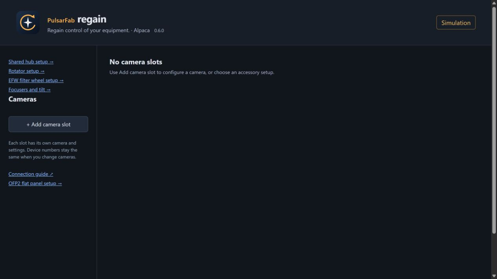

This actual browser render uses an empty camera-profile file and explicitly
simulated hub sources. The fixture verified first-slot creation/save afterward,
with no camera selected, equipment connection or console errors.

For a new installation, create an empty configuration with fresh identities:

```text
regain-alpaca --hub-init --hub-config ABSOLUTE_NEW_FILE_PATH
```

Choose a new filename in an existing writable directory. Creation never replaces
an existing file and starts no host, HTTP listener or equipment connection. The
result has no sources or outputs. Then start `regain-alpaca --hub-config` with
that file and use the shared editor to add them, review and apply. Native setup
can also create a file through the shared selector as described below.
If creation times out or reports uncertain durability, inspect the selected file
before another action. Never treat an unknown result as proof that creation failed.

1. Expand a source or output to edit its fields. Available choices and parameter
   descriptions come from the host. Saved IDs and device numbers stay fixed.
2. Use **Status** for cached source diagnostics or **Inspect** to open a temporary
   connection and read capabilities. Switch inspection supports bounded pages.
3. Select **Review changes**. Correct any field errors and inspect the preview.
   Validation does not connect equipment.
4. Disconnect all output clients, then select **Apply reviewed configuration**.
   The host checks the saved revision and writes the update atomically. Another
   editor's change causes a conflict instead of silently overwriting it.

If the outcome is uncertain, select **Reload saved configuration** before another
change. Reload explicitly opens a new setup connection and reads the saved
configuration and host status. It never repeats Apply, connects equipment or
starts the host. Other clients retain their leases. After host loss, equipment
clients still need explicit reconnect or HTTP frontend restart; broader
reconnect/resume controls remain in development. Stopping the HTTP frontend
leaves the shared host running.

Select **Manage upstream credentials** to save a complete Authorization header.
The masked input is cleared before sending; configuration holds only the resulting
reference. Protection, labels, descriptions and limits come from the same host
descriptors as native setup. Copy the reference into a source, review and apply.
For rotation, create a new reference, apply it, then remove the unused old one.
Saved configuration references are protected from deletion.

The editor retains the reference before sending, including if the reply is lost.
Reload and select **Read credential status** before another change. Status returns
busy while storage work is pending; no creation/removal is repeated automatically.
Retain the reference separately before navigating away or closing the page.
Neither browser nor managed string copies are claimed to be securely erased.

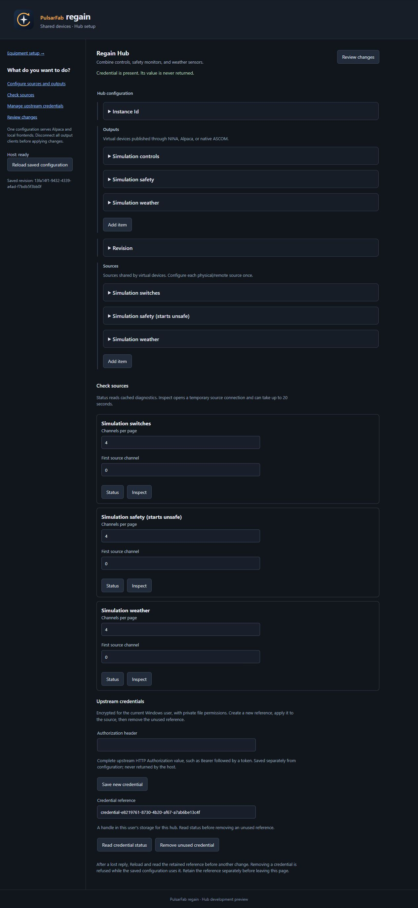

This is the actual browser editor against the production host with simulated
equipment. Its disposable credential was subsequently removed; the input is
empty and the configuration remains unchanged.

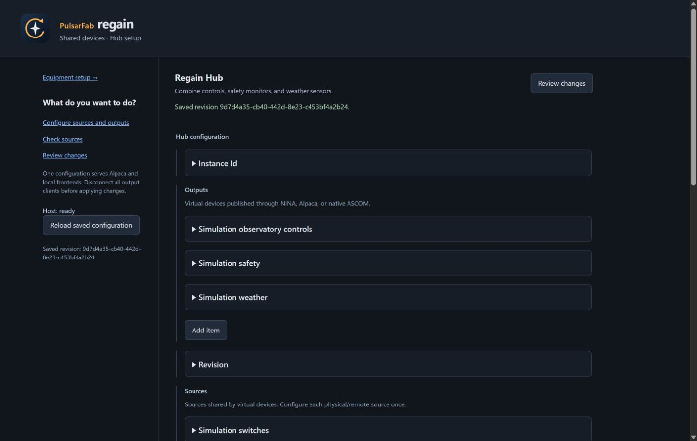

This screenshot shows a hardware-free test. It is evidence of the editor workflow,
not real-device acceptance. Interactive acceptance and
conformance remain on
the [hub plan](hub-plan.md).

The current preview offers Switch v3, SafetyMonitor v3 and ObservingConditions v2
with nonblocking Connect/Disconnect and Connecting. Legacy Connected also works.
DeviceState reads cached operational values and omits unavailable Switch/Weather
readings; it never makes stale measurements fresh. Switch channels report
CanAsync=false. A failed asynchronous connection stays visible through Connecting
until an explicit connect or disconnect; polling does not retry it. Connected
means a lease on the virtual output, so use source diagnostics to assess upstream
health. Conformance-tool and real-device acceptance checks remain pending.

## Native NINA development preview

The shared native selector used by NINA and ASCOM also offers **Create new
configuration…**. Choose a new filename in an existing directory. Creation
delegates once to the Rust CLI and retains the filename before sending; it creates
fresh empty identities without starting a host or equipment. Then select **Load
hub outputs** and **Edit shared configuration** to add sources and outputs. An
empty configuration has nothing to select/save yet, but remains editable.

If creation cannot be confirmed, **Create**, **Browse** and **Load** stay blocked.
The retained filename remains read-only and copyable. Select **Read retained
configuration file** to identify the existing file or its absence. An unreadable,
malformed or unsupported file keeps that guard in place. This read starts no host
and does not validate equipment settings; normal host loading performs validation.
It never repeats creation. Retain the filename before closing the window.

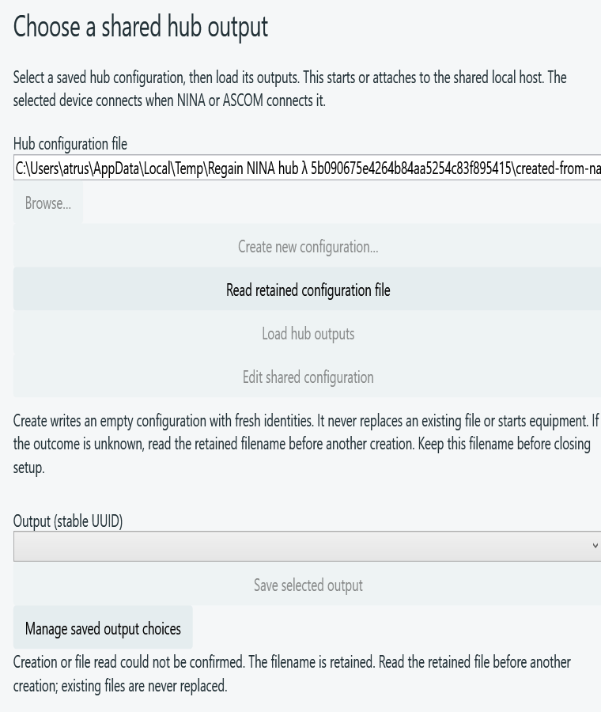

This is the actual WPF selector in a private automated fixture. The production
executable created an empty file; the fixture discarded its reply to verify the
reconciliation flow. No equipment was activated by creation or file reading.

The plugin exports Switch, SafetyMonitor and Weather choices using NINA's
3.2.0.9001 interfaces. Each class includes a **configure** choice. Open its setup,
browse to the saved hub configuration, select **Load hub outputs**, then save the
desired output. Rescan equipment to see all saved choices, or connect the chosen
device. Names identify simulation explicitly. UUIDs identify outputs, so renaming
or reordering does not change the saved equipment selection.

Setup uses the existing Regain theme and a private local connection. It starts or
attaches to the shared host, without an HTTP listener or ASCOM output. Select
**Edit shared configuration** after loading outputs to edit sources, channel
mappings, safety policies and weather settings. Field labels, descriptions,
choices, defaults and bounds come from the host's schema. The selector and editor
do not acquire equipment leases.

1. Expand a source or output to edit its fields. IDs remain fixed and can be
   expanded for inspection; new items receive new IDs. Collections show up to
   32 items per page. Correct invalid input before changing the form structure.
2. Select **Review changes** to validate through the host and inspect the redacted
   configuration. Further edits invalidate that review.
3. Disconnect all output clients, then select **Apply reviewed configuration**.
   The editor sends one revision-checked request and reloads the saved result.
   A conflict or uncertain outcome requires reloading; Apply is never replayed.
4. Use **Source health** for saved host status or cached source diagnostics.
   Reading health does not open an equipment connection. **Inspect saved source**
   explicitly opens a shared connection and releases only its temporary lease.
   Choose the first channel and page size; **Inspect next channels** advances a
   Switch result. The host supplies their labels, defaults and limits. Inspection
   uses saved settings, reports simulation and individual property failures, and
   never establishes live safety permission. Review again before Apply.
   **Export setup diagnostics** saves public host status from the last reload and
   the last completed source observation with its revision and observation time.
   It excludes the configuration and credential values. It does not refresh data.
   Close the editor and
   select **Load hub outputs** again to refresh the output choices.

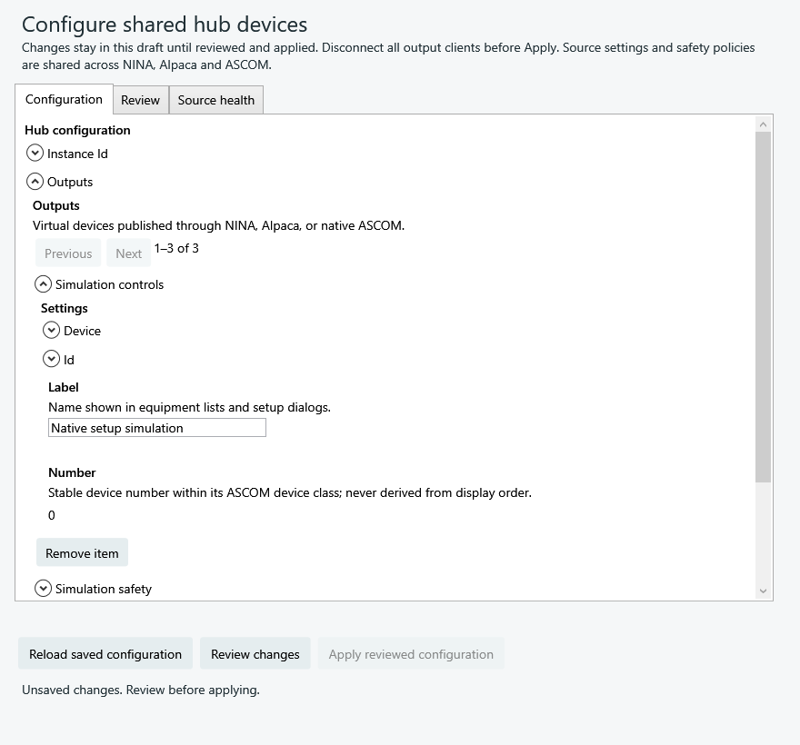

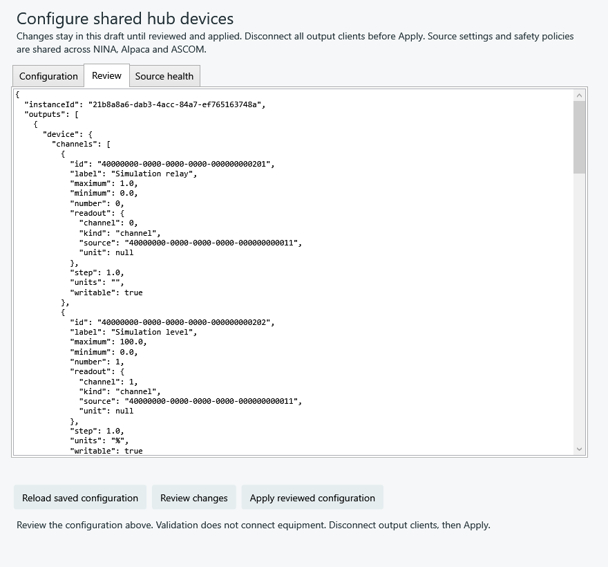

These are renders of the actual WPF window during an automated simulation test
against the production host. They demonstrate setup; interactive NINA and
real-device acceptance remain pending. Broader device support remains on the plan.

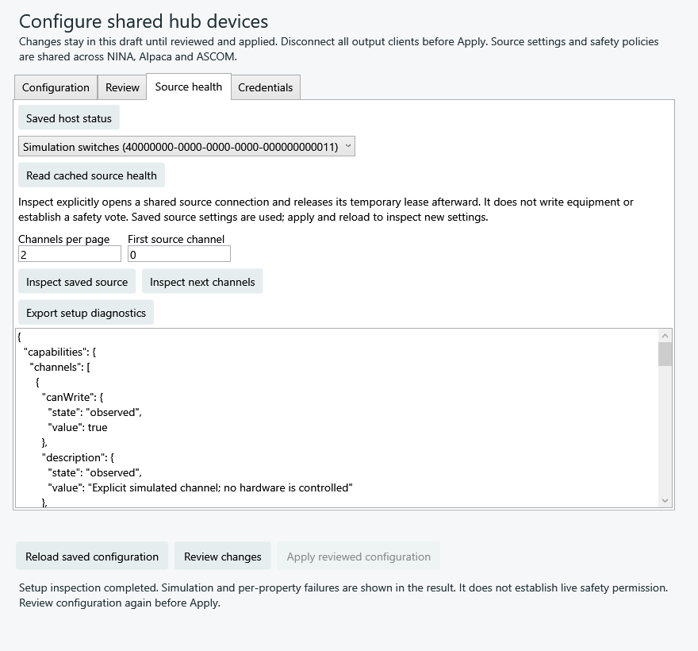

This is the shared NINA/ASCOM window against the production host in simulation.
Inspection works through a temporary source lease; another connected frontend's
lease is preserved. Changing the selected source or page input clears the next
cursor. Obsolete revisions and lost replies require explicit reload; inspection
is never replayed automatically. New sources must be applied and reloaded before
they can be inspected.

Use **Simulation** in the native editor, or expand **Simulation controls** under
a source in web setup, to change saved sources explicitly configured as simulated.
The host supplies the same labels, defaults, limits and fault choices to both
editors. Select **Read current simulation and reset form** first: initial values
are new-runtime defaults, and reading clears the field selections. Check **Change**
only for the fields to update, then **Apply selected simulation changes**. Other
readings remain unchanged. These changes affect every frontend sharing this
runtime immediately; they do not edit or persist the hub configuration.

Weather controls can mark a **Sensor absent** or change its reading and sample
age. Safety input feeds the usual polling and recovery confirmation; it does not
grant permission immediately. Fault injection can exercise failed reads, timeouts
and uncertain Switch writes. Clearing the fault does not clear an uncertain-write
latch: disconnect every source lease before reconciling and retrying commands.
After a lost reply or revision conflict, reload and read the current state before
another change. The editor never replays the update automatically.

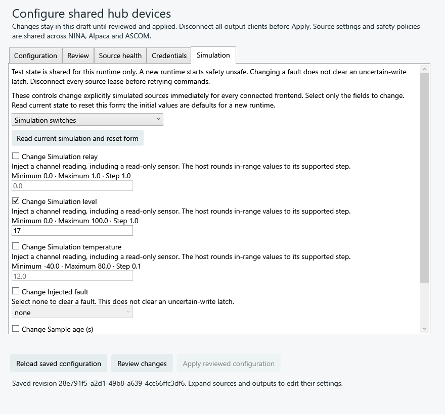

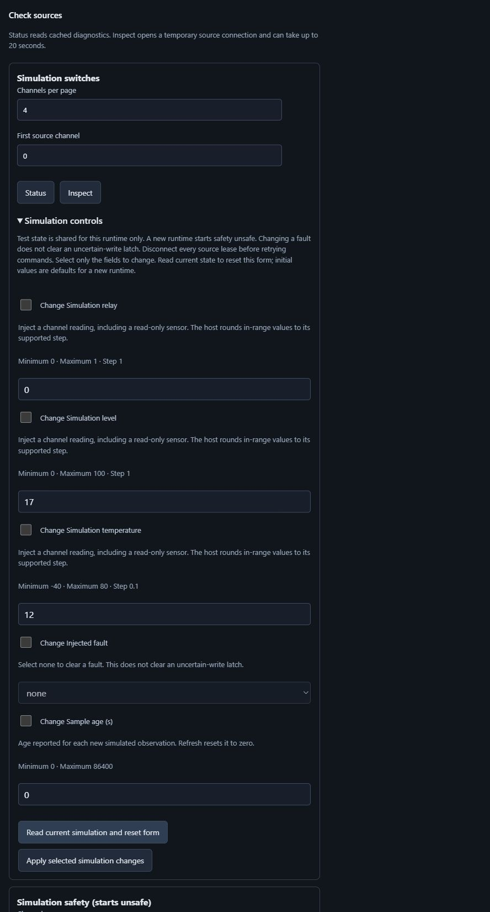

These are the actual shared WPF editor and browser against the production host
with explicitly simulated sources. The browser readback verifies the changed
level and preserved temperature. No attached equipment is controlled by these
simulation fields.

Use **Output health** in the shared native editor, or **Check output health** in
web setup, to read a saved output's cached state. Choose its first item and page
size, then **Read cached output health**; **Read next output items** advances the
host's cursor. New outputs must be applied and reloaded first. Labels, defaults,
bounds and the reply schema come from the host. Successful reads preserve a
configuration review; lost, malformed or obsolete replies require explicit Reload.

Safety shows the whole output's current permission even when only some members
are visible. Member details include raw/effective state, reason, failure/unsafe/
recovery counters, evidence age and recovery hold against the saved policy. An
inactive controller shows unknown/unsafe. Reading this page cannot connect
equipment, count a safety observation or establish permission. Switch shows
reserved channel numbers, freshness/errors and configured write intent; live
write permission is checked separately. Weather reports each metric independently.
These are observations of caches, not a simultaneous equipment snapshot.

**Export observed diagnostics** in web setup, or **Export observed output
diagnostics** in native setup, saves the completed observation with its time and
revision plus public host status from Reload. Native exports can also include
the last source observation. Editable configuration and credentials are excluded.
Exporting does not refresh data; Reload clears the previous output observation.
Actual next-retry scheduling will be added separately; no countdown is inferred
from configured polling or backoff.

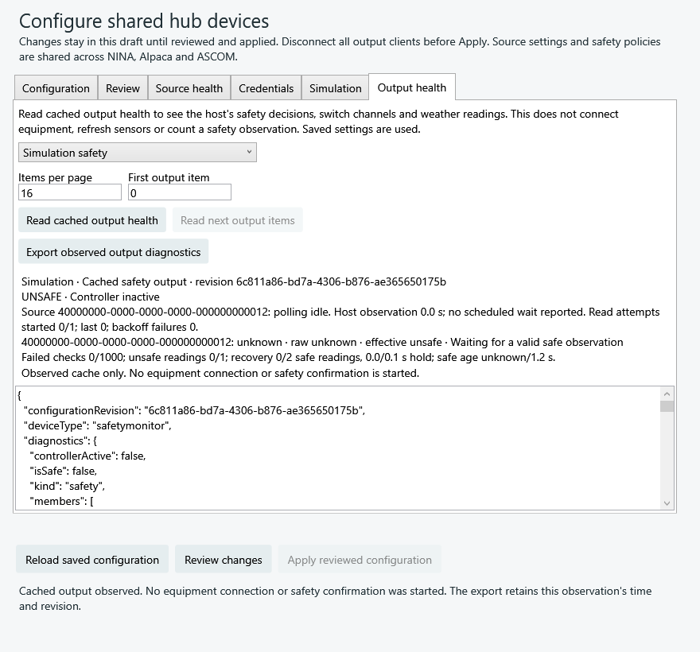

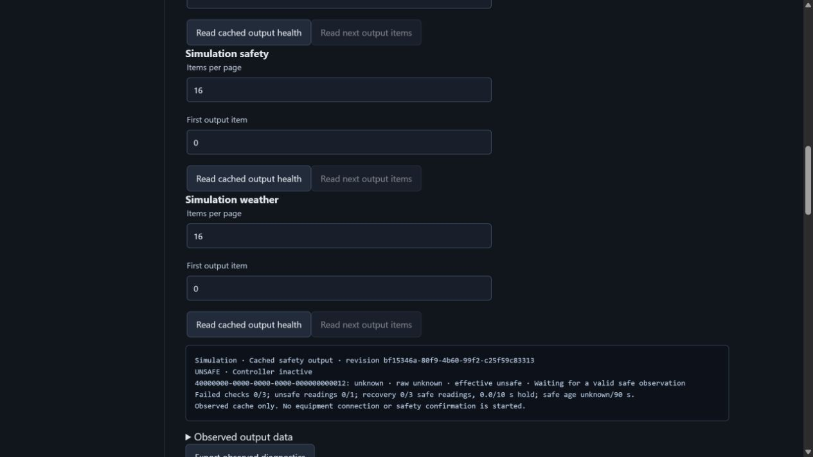

Source health also shows the real polling phase, attempts and scheduled wait at
the host's observation time. Cached reads do not advance that time. A waiting
source can be delayed by other actor work; the value is not a live countdown.
Connecting/sampling means I/O is in progress, idle means no source lease, and
suspended means no representable automatic polling deadline. These observations
never replay a control command or restore safety permission.

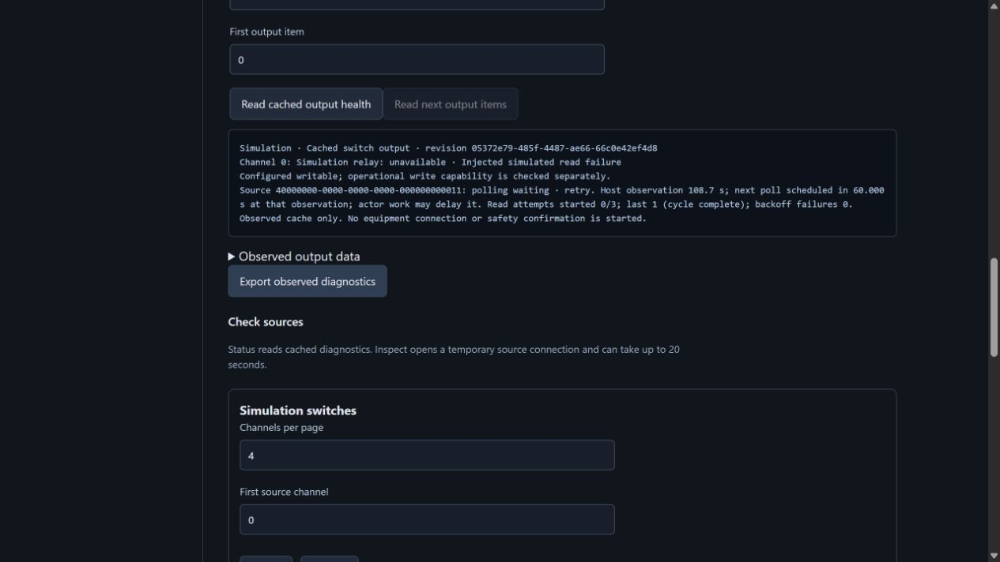

This actual browser test injected a read failure into an explicitly simulated
Switch source. Its independent output client remained connected while the editor
read and exported the retry observation. The editor added no lease. The fixture
subsequently disconnected that client and stopped its own host and publisher.

These are the actual shared WPF editor and browser using the production host with
private simulated sources. Safety remains unsafe and all source leases remain
zero. They demonstrate diagnostics and export, not hardware acceptance.

Use **Credentials** to save an upstream Authorization header in the host's
separate user storage. Its labels, descriptions, length limits and protection
description come from the host. The masked input is cleared before dispatch and
on reload/close; values are never returned or inserted into the configuration.
This does not promise erasure of every managed-string or OS copy.

Copy the resulting **Credential reference** into the source's settings, then
review and apply. For rotation, save a new credential, apply its reference, then
**Remove unused credential** for the old one. The host refuses removal while the
saved configuration uses it. Credential changes invalidate an earlier review.

The reference is chosen and retained before sending. If the reply is lost,
reload and select **Read credential status** for that reference before another
change; do not repeat creation. Status reports busy while a configuration or
credential operation is still running. The native editor keeps the reference
across reloads during this window; retain it separately before closing the window.
The web editor offers the same credential operations under **Manage upstream credentials**.

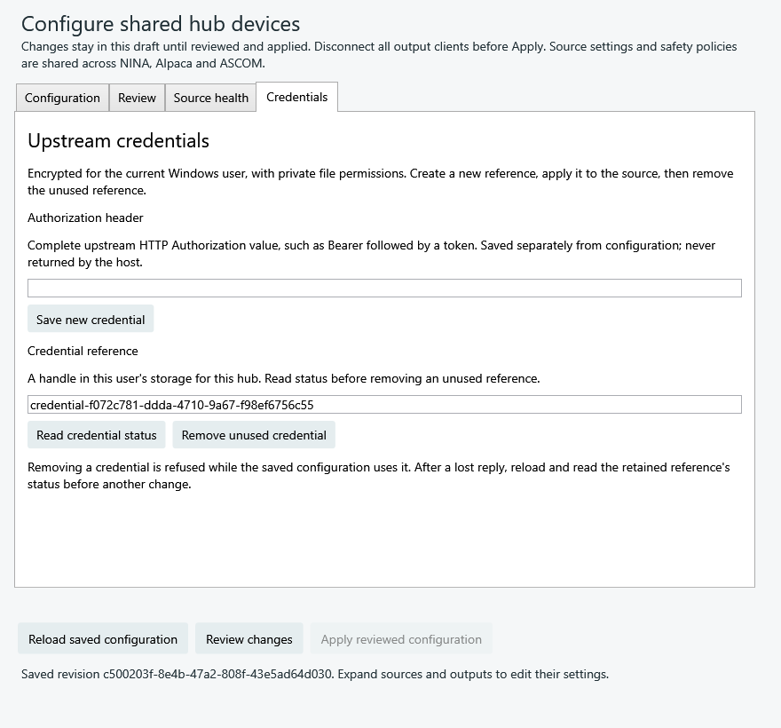

This is the actual shared WPF editor against the production host with simulated
equipment. The reference is a temporary fixture and the secret field is empty.

Select **Manage saved output choices** to view the saved choices for this class.
Each entry identifies its configuration path, hub instance and output UUID.
Removing an entry updates the native chooser list; it leaves the shared hub
configuration and connected clients running. Rescan equipment afterward. To add
it again, load its configuration and save that output. A competing save requires
an explicit reload before another change; unreadable selection files are preserved.

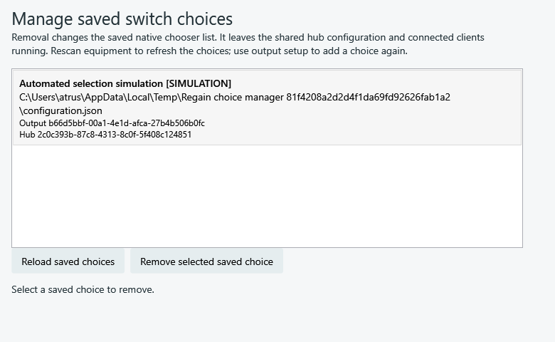

Selections are stored in `%LOCALAPPDATA%\Regain\hub-frontends.json`. They contain
the configuration path, hub instance and output IDs, class, label and simulation
marker. Source settings and policies remain in the host configuration. Competing
selection saves fail with a revision conflict; an unreadable file is not overwritten.
The development overrides are `REGAIN_HUB_HOST` for the host executable and
`REGAIN_HUB_BINDINGS` for the selection file.

Connecting a saved choice verifies its instance/output/class again. Changing the
configuration path cannot silently select a different instance. NINA and Alpaca
hold separate leases; disconnecting either frontend leaves the other available.
Getters never launch or reconnect the host. Reconnect explicitly after transport
loss; retired Switch objects cannot send commands in the new session.

Safety reads the host's current decision and returns unsafe on local failure.
Weather returns NaN for unavailable or stale measurements independently. Switch
gauges are read-only. When a writable capability cannot be checked, reconnect
after resolving the source failure to restore that control. Failed writable
readback raises an error: NINA's completion loop must not treat NaN as success.
No write is automatically replayed after an uncertain result.

Production-host and NINA-interface tests cover these behaviors. Interactive NINA,
conformance and real-device acceptance remain pending before release.

## Native ASCOM hub setup (development)

Open **Hub outputs setup** in the Regain ASCOM Start menu group, or run the
installed `Regain.ASCOM.Register.exe /hubsetup`. The manager reads saved choices
and machine registration inventory without attaching to the host or equipment.
Choose a Switch, SafetyMonitor or ObservingConditions output using the same
selector and configuration editor as native NINA. Loading outputs and editing
configuration explicitly attach to the local host without equipment leases.

Select a saved choice and **Register / refresh in ASCOM**. Windows requests
administrator approval; use the same Windows account. Both ASCOM Chooser views
receive the output, bound to this installation, selection file and user. Hub and
output UUIDs determine identity, so changing a label preserves its CLSID/ProgID.
Simulation remains visible in the Chooser name. Registering a choice does not
connect equipment; the ASCOM client's explicit connection does that.

Use **Remove ASCOM registration** before **Remove saved choice**. Registration
removal leaves connected clients running and can remove an owned orphan after
its selection file disappears. Entries belonging to another owner/install/file
or newer version are protected. After a failure or unknown completion, **Reload
inventory** and inspect `%LOCALAPPDATA%\Regain\ASCOM\registration.log` before
another action. The manager never repeats an uncertain registry edit or kills
its elevated helper. Inventory status describes records, not a live device test.

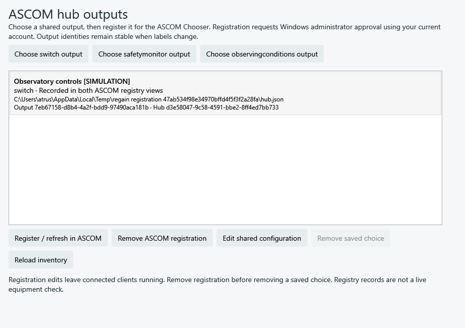

This is an actual WPF render with private test registry roots and non-executable
fixture paths; no installed hardware driver was activated. Uninstall now removes
owned dynamic entries before deleting application files, preserving other installs
and settings. A cleanup failure retains the installation for explicit recovery.
Production-helper and installer lifecycle CI now pass, including installed
metadata, in-use protection, conflict recovery, orphan cleanup and other-install
preservation. Interactive frontend/vendor acceptance and conformance remain
required before this development feature is released.
