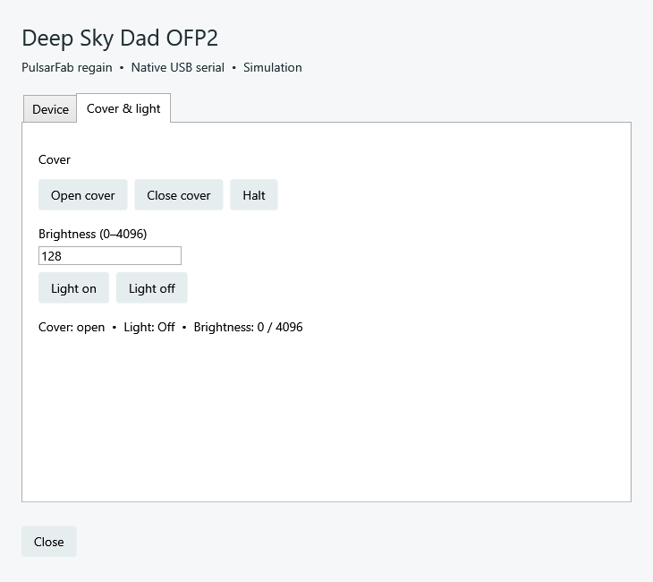
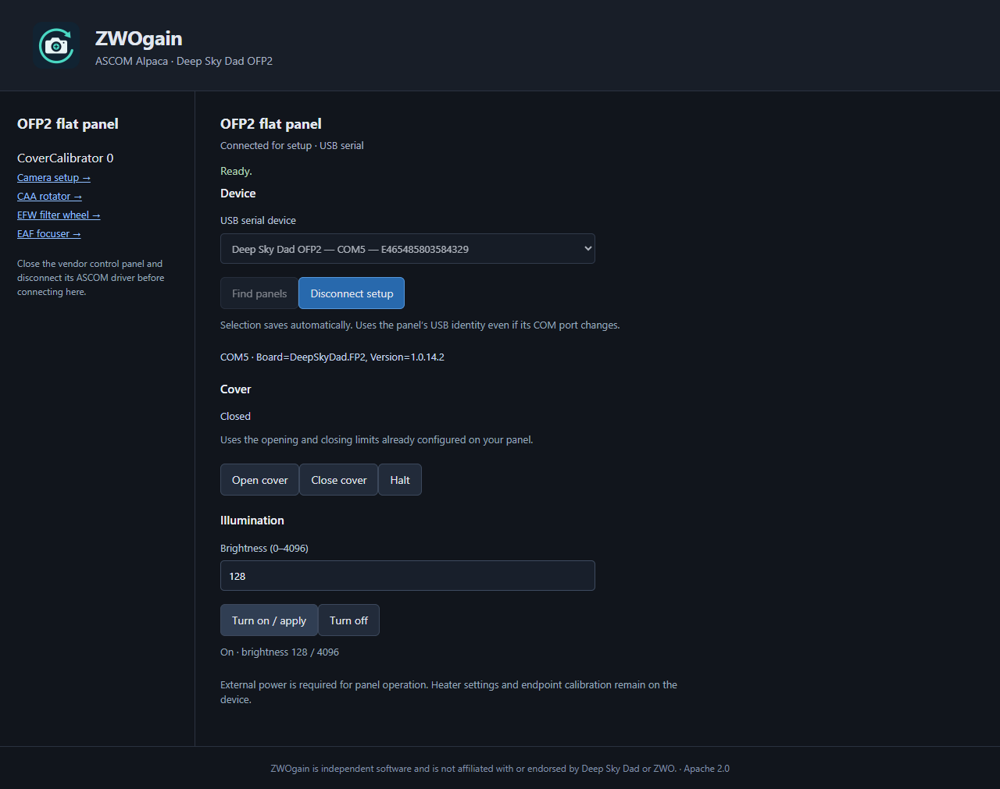

# Deep Sky Dad OFP2 flat panel

`regain-ofp2` is a native Rust library and serial worker for the **OFP2**
(FP2 board, product type 3). It talks directly to USB CDC serial. The vendor's
ASCOM driver, control panel, SDK, and .NET are not required at runtime.
The existing Rust Alpaca server exposes it as **CoverCalibrator device 0**.
This support is included from release 0.4.0.0.

## Native Windows ASCOM

Current source and CI builds add **PulsarFab regain Deep Sky Dad OFP2**
(`ASCOM.Regain.OFP2.CoverCalibrator`) to the ASCOM CoverCalibrator chooser.
Release 0.4.0.0 includes Alpaca support only. Build the updated ASCOM package
with `scripts/build-ascom.ps1` and `scripts/build-ascom-installer.ps1`.

1. Install the regain ASCOM package and connect the panel's USB and external power.
2. Disconnect its vendor driver and Alpaca connection to release the serial port.
3. Select **PulsarFab regain Deep Sky Dad OFP2** in your application's ASCOM
   flat-panel chooser, including NINA's ASCOM flat-panel selection.
4. Open **Setup**, refresh devices, select the panel, and connect to test it.
   The **Cover & light** tab provides Open, Close, Halt, and brightness 0–4096.
5. Close setup and connect from the application. The Start menu's **OFP2 cover
   and flat panel setup** shortcut opens the same shared server.

`Regain.Ofp2.ASCOM.exe` is an out-of-process COM server. Separate 32-bit and
64-bit applications share one `regain-ofp2.exe` worker and one exclusive serial
connection. Each client has its own connection lease; disconnecting or disposing
one client leaves the others connected. The final disconnect releases the worker
and port. An open setup dialog keeps its connection until it closes, and cannot
disconnect a panel owned by a connected ASCOM client.

This sharing covers regain ASCOM clients. The vendor driver and regain Alpaca
still need exclusive ownership relative to the native ASCOM server. Use NINA's
ASCOM selection when sharing with another ASCOM application.

The ASCOM profile is `%LOCALAPPDATA%\Regain\Accessories\ofp2-ascom.json`,
separate from the Alpaca profile. Selection uses the USB serial, so COM-port
renumbering does not select another panel. Native ASCOM requires .NET Framework
4.8 and ASCOM Platform; the Rust serial worker remains SDK-free.



Production WPF setup controls rendered with the OFP2 simulator. This screenshot
shows the new native UI; it is not a new physical-device validation.

The native driver implements `ICoverCalibratorV1`: cover operations return while
motion continues, `CalibratorOn(0)` is Ready at brightness zero, and
`CalibratorOff()` is Off with reported brightness zero. Invalid brightness is
rejected before actuation. Communication faults are reported without retrying
commands; state properties report Error on a failed status read.

Run `scripts/test-ofp2-ascom.ps1` for isolated 32/64-bit shared-client tests.
It checks one worker, independent leases, final disconnect cleanup, cover
operations, brightness limits, and zero-brightness semantics. Add `-Hardware
-Serial YOUR_USB_SERIAL` only when cover movement is safe. The hardware test
returns an initially open or closed cover to its starting endpoint and restores
its initial illumination on success.

## Connect through Alpaca

1. Connect USB and the panel's external power supply. Close any vendor control
   panel and disconnect other applications using its serial port.
2. Build `cargo build --workspace --release --locked`, or use a package that
   includes `regain-ofp2` beside `regain-alpaca`.
3. Start `target/release/regain-alpaca --port 11111` (add `.exe` on Windows).
4. Open `http://127.0.0.1:11111/setup/v1/covercalibrator/0/setup`, click
   **Find panels**, select the OFP2, and **Connect for setup**.
5. Test cover and lighting controls, then disconnect setup. Select the
   **Deep Sky Dad OFP2 · PulsarFab regain** CoverCalibrator in your Alpaca client.
   NINA and Windows ASCOM applications can use the ASCOM Platform's Alpaca
   discovery/Chooser support for their flat-panel connection.



This historical, pre-rebrand screenshot shows the physical OFP2 on Windows, firmware 1.0.14.2,
with the cover closed and brightness 128. It is not a simulator screenshot.

The profile is saved beside `cameras.json` as `cameras.ofp2.json`. Selection is
by USB serial number, so a COM-port change does not select a different device.
The UUID stays stable when editing the profile. Only configured devices appear
in Alpaca management discovery. Multiple Alpaca clients share one exclusive
serial worker; the last client disconnect releases it. A missing, busy, or
ambiguous device fails connection rather than selecting another panel.

Windows uses its built-in USB Serial Device driver. Do not replace it with
WinUSB/Zadig. On Linux, grant the server account access to its `/dev/ttyACM*`
port (commonly through the distribution's `dialout` group). On macOS the
port is normally `/dev/cu.usbmodem*`. Candidate enumeration uses USB
`2e8a:000a`, which is shared by other RP2040 devices; the worker verifies
the board identity and product type before sending any actuation command.

## Rust library and worker

```rust,no_run
use regain_ofp2::{Panel, serial::Serial};

let mut panel = Panel::new(Serial::open("COM5")?)?;
println!("{:?}", panel.identity());
panel.light_on(128)?;
panel.light_off()?;
panel.move_cover(true)?; // asynchronous physical movement
println!("{:?}", panel.status()?);
panel.halt()?;
# Ok::<(), anyhow::Error>(())
```

The library accepts a `Transport` implementation for fixture testing or a
different serial backend. The production serial backend uses the Rust
`serialport` crate with OS APIs and no libudev/vendor binary dependency.
The library is synchronous; applications serialize calls and poll `status()`
during motion. They must keep the transport alive until the operation finishes
or explicitly halt. The CLI worker performs this polling automatically.

```powershell
.\target\release\regain-ofp2.exe list-details
.\target\release\regain-ofp2.exe status --serial YOUR_USB_SERIAL
.\target\release\regain-ofp2.exe serve --serial YOUR_USB_SERIAL
```

`serve` accepts newline-delimited JSON and writes exactly one response per
request. Commands are `identity`, `status`, `open`, `close`, `halt`, `off`, and
`on` with an integer `brightness` in 0–4096. For example:

```json
{"command":"on","brightness":128}
```

Replies are `{"ok":true,"result":...}` or `{"ok":false,"error":"..."}`.
An initial UTF-8 BOM is accepted for .NET Framework clients. Identity includes
the USB serial, current port, board firmware, product, and explicit simulation
flag. Status includes cover state, logical degrees, physical `light_on`,
logical `calibrator_on`, brightness and maximum brightness.

`--simulate` is explicit and uses serial `SIM-OFP2`; it is never a hardware
fallback. Discovery only probes candidate ports with read commands. Connecting
does not alter heater settings, motion limits, or illumination.

## Serial protocol and evidence

Source of command names/settings: installed **Deep Sky Dad FP ASCOM 1.0.3.6**,
assembly version `1.0.3.22767`. Its SHA-256 is
`a260a84d77d0262cbd16355b85dc55fd0f6a1e366572f53f01088c9ba22951a3`.
The assembly was inspected locally for interoperability; no vendor code or
binary is copied into the Rust implementation. Manufacturer downloads and
manuals are on the [official software page](https://shop.deepskydad.com/software-and-documentation/).

Transport: **115200 baud, 8 data bits, no parity, one stop bit, RTS/CTS flow
control, DTR enabled**. Wait 1.5 seconds after opening and pace requests by
50 ms. Commands are ASCII `[COMMAND]`, without a newline. Replies end in `)`:
`(value)` or `(OK)`; `!100)` is the vendor driver's unknown-command error case.
Each response is bounded to 256 bytes and a two-second read deadline. No
actuation is automatically retried. A transport or malformed-response failure
latches the session fault; check the panel and reconnect all clients to clear it.

| Request | Meaning | Observed response |
| --- | --- | --- |
| `[GFRM]` | Board and firmware | `(Board=DeepSkyDad.FP2, Version=1.0.14.2)` |
| `[GPRD]` | Product type | `(3)` for OFP2 |
| `[GOPS]` | Cover report | `(0)` closed, `(1)` open, `(2)` moving |
| `[GPOS]` | Logical position in degrees | `(0)` open endpoint, `(270)` closed endpoint |
| `[GMOV]` | Motor moving (inspection only) | `(0)` after halt |
| `[GLBR]` | Brightness setting | `(0)` / `(128)` / `(4096)` |
| `[GLON]` | Physical illumination | `(0)` / `(1)` |
| `[STRG0]`, `[STRG270]` | Set open/closed target | `(OK)` |
| `[SMOV]` | Begin movement to target | `(OK)` |
| `[STOP]` | Halt movement | `(OK)`; settling is asynchronous |
| `[SLBR128]` | Set brightness (0–4096) | `(OK)` |
| `[SLON1]`, `[SLON0]` | Enable/disable illumination | `(OK)` |

Open/close sends target then movement, once each. On sends brightness then
enable; off sends brightness zero then disable. Heater writes used by the
vendor driver during connection are deliberately absent here.

Two firmware behaviors matter:

* **Halt is asynchronous.** Immediately after STOP, GOPS can still be 2.
  After settling, firmware reported GOPS=1 with GPOS=232, even though the
  panel was stopped between endpoints. Rust cross-checks GOPS with GPOS and
  reports `Unknown` there. A subsequent Open is a real movement to zero.
* **Zero brightness reads physically off.** After `SLBR0`, `SLON1`, GLON is
  zero. A successful `CalibratorOn(0)` still yields logical ASCOM `Ready` in
  the current session. Off clears this state. Reconnection reads the physical
  state and therefore reports Off at zero; the protocol cannot distinguish a
  physical off-button press from an already-dark logical On(0).

Requested movement has a 120-second deadline. An unexpected stop before its
target or a timeout faults the session instead of claiming completion. The
worker attempts halt on normal pipe closure while its requested movement is
still pending and the serial session is healthy. Abrupt process termination
or USB loss cannot guarantee a physical stop. Light state persists on ordinary
disconnect; call CalibratorOff when finished.

## Alpaca contract

Implements **ICoverCalibratorV1** at `/api/v1/covercalibrator/0/`:
Brightness, MaxBrightness, CalibratorState, CoverState, CalibratorOn,
CalibratorOff, OpenCover, CloseCover, HaltCover and common driver/connection
members. Standard states use the ASCOM enum values. Cover errors and
calibrator errors are returned as `Error` (5), while failed operations include
an Alpaca error number/message. Brightness is zero when off. Motion is
asynchronous and polled using CoverState. Standard V2 asynchronous connection
and DeviceState members are not advertised.

`Action("Regain.Status", "")` and `Action("Regain.Identity", "")` return
JSON encoded in the required ASCOM **string** result. Arbitrary serial commands
are not exposed. See the [ASCOM interface specification](https://ascom-standards.org/newdocs/covercalibrator.html)
for the standard member semantics.

## Validation

Windows physical tests passed on **2026-09-19 PDT** (2026-09-20 UTC):
identity/product detection, exclusive port ownership, brightness 0/128/4096,
off, full open/close, mid-travel halt and resume, and restoration to closed/off.
The sequence passed separately through the Rust worker and HTTP Alpaca server.
See [reviewed evidence](ofp2-evidence.json). Linux/macOS hardware and a complete
ConformU run remain untested; CI exercises the protocol simulator on each OS.

```powershell
# No physical device needed:
cargo test -p regain-ofp2 --locked
python scripts/test-ofp2.py

# Moves and illuminates the explicitly selected real device, then restores it:
python scripts/test-ofp2.py --hardware --serial YOUR_USB_SERIAL --report artifacts/inspection/ofp2-hardware.json

# Trace application-level serial bytes from commands recovered from the driver:
.\scripts\inspection\ofp2_probe.ps1 -Port COM5 -Exercise -MotionDetails
```

The inspection script logs exact transmitted/received ASCII frames and times;
these are **serial-level traces**, not USB bus captures. Full traces and local
decompilation stay under ignored `artifacts/inspection` and `.reference`.
