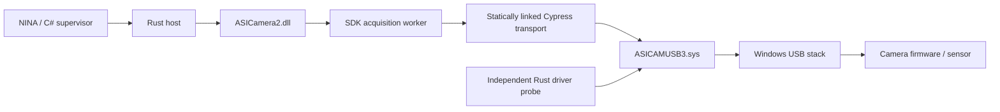

# Windows ASI transport investigation and experiment plan

Initial experiments: 2026-09-13, ASI676MC, Windows x64. This is research tooling,
not a change to the installed plugin's recovery policy. The <=30-second default
retry cutoff and restart/reconnect fallback remain in force.

## What was established locally

The installed camera service is `ASICAMUSB3`; its INF reports ZWO driver package
3.28.0.0 (2026-05-20). The attached camera is USB VID `03c3`, PID `676d`.
The driver interface GUID is `{c5b27530-3592-4e87-9e99-c2bafd5e5692}`.

| Binary | SHA-256 |
| --- | --- |
| SDK 1.41 `ASICamera2.dll` | `0c8778c3cce2012961b079e3c7d0d8348a8b3823939335d9e98148cb5d5dc34a` |
| Installed `ASICAMUSB3.sys` | `19fb5712d2e064b50de215c7cbfacc4068cd34415b3f02c010d9563206e98db9` |

The DLL imports SetupAPI enumeration, `CreateFileA`, `DeviceIoControl`,
`GetOverlappedResult`, events and waits. It contains `CCyUSBEndPoint` and
`CCyBulkEndPoint` RTTI. The driver contains Cypress handler names and a
`cyusb3.pdb` build reference. Together with the observed IOCTL/header layout,
this establishes a Cypress-derived transport, not a WinUSB interface in this
installed configuration.

The independent Python probe successfully opened that interface and read
standard USB device/configuration descriptors **without loading the SDK**.
It found USB 3.0, one bulk-IN endpoint `0x81`, 1024-byte maximum packets and
`bMaxBurst=15` (up to 16 packets per burst). The driver's version IOCTL returned
`0x01020200`; this is distinct from the INF package version, so both should be
recorded in future incident reports.

The [Cypress programmer reference](https://community.infineon.com/gfawx74859/attachments/gfawx74859/usb-superspeed-peripherals/31113/1/CyUSB.pdf)
describes the transport's control/bulk operations and status structure. Our
trace confirmed a packed 38-byte header: endpoint at byte 13, NTSTATUS at 14,
USBD status at 18, buffer offset at 30, length at 34. These offsets are pinned
to the inspected ABI; they are not guessed from a naturally aligned C struct.

Observed calls include `0x220020` for control transfers and `0x22004b` for
direct bulk transfers. During recovery the SDK also sends `0x220044` and
`0x22002c`, consistent with Cypress abort/reset-pipe operations. The direct
probe only issues the observed version query and standard GET_DESCRIPTOR
requests. No custom vendor control command has been replayed by our code.

## Capture lifecycle: transfer precedes public download

Frida hooks were attached only to a newly started diagnostic Rust host.
Both SDK calls and driver completion events were recorded. The host deliberately
waited 500 ms after seeing ready before calling the public download function.

| Experiment | Successful USB bytes | SDK ready after start | Public download duration |
| --- | ---: | ---: | ---: |
| 512 × 256 RAW16, 100 ms | 262,144 | 174 ms | <1 ms clock resolution |
| 3552 × 3552 RAW16, 100 ms, three frames | 25,233,408 each | 218–235 ms | 0–10 ms |
| 3552 × 3552 RAW16, 1 second | 25,233,408 | 1,172 ms | 10 ms |

These are instrumented observations, not performance benchmarks. Full-frame
transfers used 24 requests of 1,048,576 bytes plus one of 67,584 bytes. The SDK
queued overlapped reads on its own worker thread. All successful frame bytes
arrived before status became 2; no driver request was submitted during the
public `ASIGetDataAfterExp` call in these runs.

The SDK also queued another set of reads, then aborted them as part of normal
completion. Every successful full frame included **25 cancelled completions**:
Win32 995, NTSTATUS `0xc0000120`, USBD `0xc0010000`. The small ROI had one such
cancelled read. An observer must associate completion errors with acquisition
phase and accepted byte count; cancellation alone is not a camera failure.

## Controlled cancellation exposed internal replay

The fault mode invokes `CancelIoEx` for exactly one pending bulk request in
the owned host, after the real `DeviceIoControl` call returned pending. It
does not fabricate a return code or edit the image buffer. We confirmed the
cancellation request succeeded and the targeted request completed cancelled.
See [Microsoft's cancellation semantics](https://learn.microsoft.com/en-us/windows/win32/fileio/cancelioex-func).

- With a one-second full-frame exposure, the SDK returned a successful image
  after approximately 1.24 seconds to ready. Only one public `ASIStartExposure`
  call occurred. There were 100 bulk submissions, 49 successful completions
  totaling 49,418,240 bytes and 51 cancelled completions.
- Repeated full-frame cancellation runs also succeeded. In hashing runs,
  23 distinct 1 MiB blocks from the earlier pass matched blocks from the later
  pass exactly by SHA-256. This is strong evidence of buffered-data replay
  inside the SDK/firmware path, rather than two independent noisy exposures.
  It does not establish a public resume API or an arbitrary byte-offset retry.
- The observed extra sequence includes a `0xBC` vendor read with `wValue=0x23`
  (reply `05` in one run), pipe abort/reset, a `0xBC` read of `0x18` (reply `00`),
  and a `0xBD` write with `wValue=0x18`, `wIndex=1`, followed by another transfer
  pass. These are **candidate register semantics**, not validated commands to
  call on other models. No meaning has been assigned to individual status bits.
- The 512 × 256, one-second cancellation experiment instead reported
  `ASI_EXP_FAILED`. It submitted three bulk requests and had no successful
  bulk completion. Thus even this camera has configuration-dependent recovery.

The initial USB block hashes did not match the application's RAW16 chunk hashes,
including after 16-bit byte swapping. The follow-up below explains this for
bin-1 RAW16 on this camera: sparse SDK pixel corrections change whole-block
hashes even though almost all individual pixels already match. Pixel bytes were
discarded; traces contain only metadata, statistics and optional hashes.
A subsequent normal full-frame capture succeeded after the ROI failure.

These tests induce cancellation, not cable faults, endpoint stalls, partial
USB packets or disconnects. The camera stayed powered. Natural failures and
ASI2600/6200 hardware were untested at this stage. Subsequent model-specific
work is recorded in [ASI2600 capture](duo-capture.md),
[ASI6200 P25 capture](asi6200-p25.md) and [transfer recovery](transfer-recovery.md).

## Follow-up: direct Rust I/O and image processing (2026-09-13)

`crates/regain-zwo` is now a separate research executable. It enumerates the
installed ZWO interface using SetupAPI and opens it exclusively, with overlapped
I/O. No ASI SDK dependency is present. It reads the driver version and standard
USB descriptors, validating the packed header, returned lengths and both driver
status fields. Enumeration does not print device paths or require a saved SDK trace.

On the ASI676MC it independently returned VID `03c3`, PID `676d`, USB 3.0,
configuration length 31, bulk-IN `81`, 1024-byte packets, burst 15, and driver
version `01020200`. Five explicit `--cancel-read` runs each submitted a 16 KiB
read to the idle endpoint, requested cancellation after 100 ms and observed
terminal completion: Win32 995, NTSTATUS `c0000120`, USBD `c0010000`, zero bytes.
An SDK full-frame capture succeeded afterward. This tests the transport primitive;
the executable does **not** arm an exposure or accept a frame.

Buffers, events and OVERLAPPED structures remain alive until terminal completion,
including the cancellation path, as required by
[Microsoft's CancelIoEx contract](https://learn.microsoft.com/en-us/windows/win32/api/ioapiset/nf-ioapiset-cancelioex).
If cancellation has not drained after two seconds, the research worker exits
without unwinding those buffers. A 30-second process watchdog covers an otherwise
stuck driver call. Descriptor requests have five-second deadlines. The current
primitive handles one request; a capture queue and supervised transport protocol
remain to be built.

### RAW16 mapping

`--compare-wire` temporarily retains completed driver buffers in Python memory
and compares individual 16-bit samples with the SDK image. No image samples are
written. The collector now covers both immediate and pending I/O completions.
It only compares consecutive successful request runs of exactly the requested
frame length; a cancelled or missing request breaks the run. These are candidate
frame runs for analysis, not accepted frames in the production driver.

For 512 × 256 ROI and 3552 × 3552 full frame at bin 1, including an ROI origin of
(16, 8), roughly 99.9% of samples match directly as little-endian words. Swapping
or scaling does not explain the remaining samples. With the exact inspected SDK
hash pinned, passive hooks identified this processing path:

| SDK 1.41 x64 RVA | Observation |
| --- | --- |
| `52b6` → virtual target `16c00` | Public download dispatches to internal retrieval. |
| `16cbb` | Internal retrieved buffer still differs sparsely from the final image. |
| `16cc3`–`16cf9` | For the observed bin-1 RAW16 path, the first and last 32-bit words are replaced from two rows inward. |
| `16dbc` → `1043c0` | Additional pixel processing occurs; disassembly accesses tables associated with dead-pixel code. |
| `16dc4` | Buffer after this routine matches the returned SDK image exactly at bin 1. |

The correction routine references a table at object offset `448` with count `440`,
and additional row/table data. Initialization code logs `HPC Dead pixel:%d` for
that table. This supports identifying a defect-correction stage; the calibration
source, all table meanings, interpolation rules and boundary cases have **not**
yet been reproduced independently. The 32-bit-word replacement is observed code;
its firmware/header purpose is not established.

The exact post-correction match includes all 12,616,704 pixels in a full frame.
It validates where the SDK conversion happens, **not** an independent decoder.
For bin 2, a 512 × 256 output required 1,048,576 driver bytes while the final image
was 262,144 bytes. The comparison correctly rejected a direct size match; the
subsequent software-binning stage still needs mapping.

### Complete-frame replay identity

In two repeat full-frame, one-second cancellation experiments, each targeted
request completed cancelled (995). Each run issued only one public exposure
command and produced two complete consecutive driver-data runs of 25,233,408
bytes. **Every byte of the first run equalled the corresponding byte of the
second run** in each experiment, followed by a successful SDK download. This
extends the earlier partial-block evidence to complete-frame identity under
these controlled conditions. The post-correction SDK buffer also matched exactly.

This is a driver-buffer observation with timing-changing instrumentation, not a
USB bus capture or a guarantee that any failed transfer can be replayed. The
failure can affect a queued read after useful data has arrived. We still need
controlled faults at different offsets, explicit frame/pass boundaries, firmware
retention limits, and an independently validated replay command sequence.

Reviewed statistics and trace hashes are in
[direct-driver experiment evidence](direct-driver-experiments.json). Raw local
traces remain ignored; no camera photos, calibration tables or serials are in
the published evidence. The new executable and inspection dependencies remain
outside the NINA plugin package.

## Public re-download and debug exports

For this exact DLL, disassembly of `ASIGetDataAfterExp` at RVA `0x51d0` shows
that it only calls its internal retrieval method when the exposure state is 2.
After that internal call, it sets the state to 0 regardless of the internal
boolean result; false maps to SDK code 11. Earlier parameter/handle checks
return without reaching this state transition. Live status queries after a
successful public download also returned 0.

This substantially weakens the experimental strategy of repeatedly calling
the public download function after a retrieval failure. The promising replay
path operates **below that API, during acquisition**. Leave public re-download
disabled; do not reset an internal state field to force another call.

Disassembly also narrows the undocumented debug ABI: `ASIEnableDebugLog`
consumes camera ID and a 32-bit enable value, and `ASIGetDebugLogIsEnabled`
consumes camera ID and writes a 32-bit result through its second argument.
The enable function changes a camera field and a global flag. The path getter
passes its second argument to another internal function; its buffer contract
has not been resolved. None of these exports were invoked. These are
version-specific observations, not vendor-supported signatures.

## Implementation plan

**Update:** complete ASI676MC acquisition and retained-frame replay now work in
the standalone Rust executable. The [SDK-free capture findings](sdk-free-capture.md)
document the implemented configuration/streaming path, sensor standby needed
for reliable retention, interrupted-read recovery and the P25 driver mapping.
The stages below also describe remaining production and cross-model work.

1. **Capture a reproducible fault corpus — tooling available now.** Run the
   passive/cancellation matrix on 2600 and 6200 cameras: full frame and ROI,
   bin 1/2, RAW16, short and longer exposures, USB-limit settings. Record SDK
   and driver hashes, USB topology, temperature, cooler power and exact camera
   model. Keep natural-failure traces separate from injected cancellations.
   Add cancellation after selected completed chunks, without fabricating
   completion results. Exit criterion: identify where replay succeeds/fails,
   whether failures are transport or firmware stalls, and their status codes.
2. **Map replay and image formatting — bin-1 processing stage located.** Trace the callers of the candidate
   `0x23`/`0x18` accesses and compare successful/failed branches. Vary one capture
   parameter at a time. Establish start, exposure-complete, readout-start,
   replay and stop semantics. Determine wire packing, row order, padding,
   scaling, binning and Bayer origin. Exit criterion: bit-exact agreement with
   SDK RAW16 output and convincing same-frame identity across replay, including
   the missing/failed portion, not just overlapping blocks.
3. **Build a Rust transport against the existing signed driver — ASI676MC capture implemented.**
   Enumeration, configuration, retained-frame readiness, bounded sequential bulk
   reads, cancellation/drain, binary delivery and retained-frame retries work.
   Next add production integration and evaluate queued I/O if throughput requires
   it. Own all request buffers until cancellation has actually completed.
   Expose progress and typed failures to the supervisor. Keep one owner of the
   camera; do not compete with the SDK for endpoint reads. Initially use a
   narrowly supported model/configuration instead of claiming SDK parity.
   Exit criterion: capture and cancel repeatedly with exact images, no leaked
   requests, bounded deadlines and successful reconnect.
4. **Add staged recovery.** Where experimentally supported, cancel/drain the
   queue, reset the pipe and ask firmware to replay a complete retained frame.
   Escalate to a fresh exposure, host replacement, reconnect and cooling restore
   when replay cannot be established. Reconnect may destroy retained data, so
   it belongs after replay attempts. Never concatenate ambiguous partial reads
   or accept an SDK “success” without a complete validated frame. Microsoft's
   [USB recovery guidance](https://learn.microsoft.com/en-us/windows-hardware/drivers/usbcon/how-to-recover-from-usb-pipe-errors)
   calls for completing cancellation before resets and coordinating recovery.
   Exit criterion: fault matrix passes without false successes or stale frames.
5. **Evaluate physical USB offload separately.** A local external process still
   shares the PC's USB controller and kernel driver. A dedicated USB host near
   the camera would move those failure domains and could retain completed
   frames for repeatable network delivery. First compare vendor-SDK behavior
   on that host; use a libusb backend only after the camera protocol is mapped.
   Add frame IDs, checksums, acknowledgement/retention and bounded retrieval
   retries. Network replay of a completed frame is a different guarantee from
   recovery of a failed camera-to-host transfer.

The preferred next prototype is user-space Rust over the installed driver.
Replacing/rebinding the Windows driver is not needed for the descriptor proof
and would add a separate variable. No replacement driver, USB filter, firmware
write or production runtime hook was installed in these experiments.

## Reproduction and evidence

Commands and dependencies: [inspection tools](../scripts/inspection/README.md).
Reviewed machine-readable results: [experiment summaries](transport-experiments.json).
Full metadata traces and PE inspection output remain under ignored
`artifacts/inspection/` locally; they include device paths. Tracing and hashing
affect scheduling, so repeat important conclusions without instrumentation.
